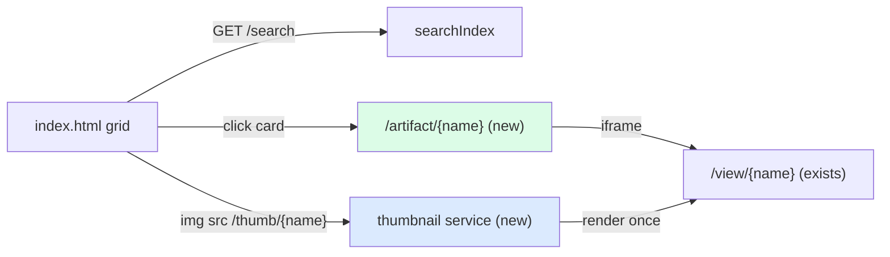
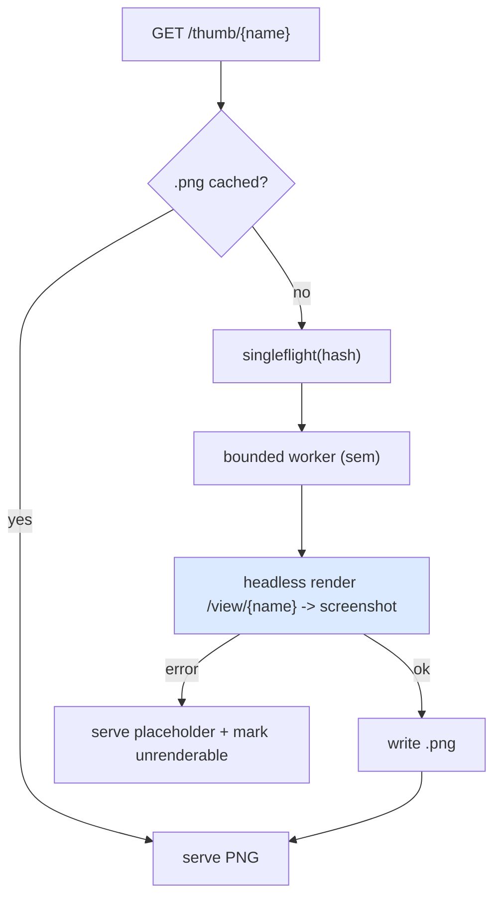

# UI/UX for Browsing at Scale: Analysis, Design and Implementation Guide

This guide is for an engineer implementing the visual-browsing layer of `serve-artifacts`. The previous features made artifacts *findable* (search, facets) and *organizable* (favorites, tags, collections). This feature makes them *browsable at a glance*: a gallery of thumbnails, a detail page for a single artifact, and a grid/list toggle, so that a library of thousands is navigable by eye rather than by reading a list of titles.

The center of gravity is the **thumbnail gallery**. Everything else in this feature is comparatively small UI work; the thumbnail is where the real engineering is, because generating a picture of an artifact means actually running the artifact in a headless browser, caching the result, and doing so lazily and safely for thousands of items. This guide spends most of its length there.

Some of §5 from the improvements roadmap already landed while building search and organization: the card grid, the search box, the facet sidebar, the result count, and the favorite/tag/collection controls all exist today. This ticket is the *remaining* visual pieces.

> [!summary]
> - **Thumbnail gallery** (the core): a `GET /thumb/{name...}` endpoint renders each artifact once in a headless browser, caches the PNG keyed by the artifact's content hash (so it invalidates on change), and generates lazily on first request with an optional background backfill. Bounded concurrency + singleflight prevent render storms.
> - **Detail page**: a `GET /artifact/{name...}` page that wraps the existing `/view` render in an iframe and surrounds it with metadata, syntax-highlighted source, the linked transcript / claude.ai link, and the favorite/tag/collection controls.
> - **Grid/list toggle**: a client-side view-mode switch; list mode is a compact table (title, project, date, tags, size).
> - **Follow-ons** (lighter): command palette (⌘K), keyboard navigation, dark mode.
> - The render pass that makes a thumbnail is the same pass §6's health check wants (does it mount without errors?) — build the renderer so both can share it.

## Part I — What exists today

The index page (`pkg/server/templates/index.html`) is already a search-driven SPA: it queries `GET /search` (`pkg/server/server.go` → `pkg/server/index.go`), renders result **cards** into a grid, and shows a facet sidebar plus favorite/tag/collection controls. Each `SearchDocument` (`pkg/server/search.go`) carries `name`, `title`, `type`, `project`, `model`, `tags`, `favorite`, `view_url`, etc. Artifacts are served by:

- `GET /view/{name...}` — the runnable render (HTML direct; JSX via a host page that loads React and compiles in the browser). This is what a thumbnail screenshots and what the detail page embeds.
- `GET /raw/{name...}` — raw bytes (useful for showing source).
- `GET /jsx/{name...}` — JSX source + auto-mount (the Babel path).

The artifact's stable identity is its `Name` (slash path relative to the serve root, no extension), produced by the scanner (`pkg/artifacts/scanner.go`). The in-memory `searchIndex` already reads each artifact's source, so a **content hash** is cheap to add there and is the natural cache key for thumbnails.



## Part II — The thumbnail gallery

### 2.1 Why this is the hard part

A thumbnail of an artifact is a screenshot of the artifact actually running. For an HTML artifact that means loading the HTML; for a JSX artifact that means loading `/view/{name}`, letting the import map fetch React, letting Babel compile, letting the component mount, and only then screenshotting. That is a headless-browser job, and at thousands of artifacts it must be cached, lazy, bounded, and invalidated correctly. The rest of §5 is ordinary front-end work; this subsystem is the reason the ticket exists.

### 2.2 The cache key: content hash

Add a stable content hash to each indexed artifact. The `searchIndex.rebuild()` already reads every artifact's body; hash it there (e.g. `sha256(body)` truncated to 16 hex chars) and expose it on `SearchDocument` as `hash`. The thumbnail for an artifact is stored at `<thumbs-dir>/<hash>.png`. Because the key is the content hash:

- An unchanged artifact reuses its cached thumbnail across restarts.
- A changed artifact gets a new hash → a new (missing) thumbnail → regenerated on next request. No explicit invalidation logic is needed.

The thumbnails directory defaults under the user cache/state dir (like the user-data DB), overridable with a `--thumbs` flag; never write it into a possibly-read-only artifact directory.

### 2.3 The endpoint and request flow

`GET /thumb/{name...}` resolves the artifact, computes its cache path from the hash, and:

- if the PNG exists → serve it (with a long cache header);
- else → generate it (bounded, singleflighted), write it, then serve it;
- on generation failure → serve a placeholder PNG (and record the failure, see §2.6).

```
handleThumb(name):
    art = index.find(name)              # 404 if unknown
    path = thumbsDir/<art.hash>.png
    if exists(path): serveFile(path); return
    png, err = thumbnailer.Get(art)     # singleflight by hash; bounded workers
    if err: servePlaceholder(); return
    serveFileBytes(png)
```



### 2.4 The renderer

Two viable engines; pick one and hide it behind a `Thumbnailer` interface so it can be swapped:

- **`chromedp` (recommended).** A Go CDP client driving headless Chrome. It gives precise control: set the viewport (e.g. 1200×900), navigate to `http://localhost:<port>/view/<name>`, wait for the mount (`#root` has children for JSX, or `load` for HTML) plus a short settle, then `CaptureScreenshot`, and downscale to a thumbnail (e.g. width 480) with `image/draw` or an `x/image` resize. Requires a Chrome/Chromium binary present at runtime.
- **Headless shell-out (zero Go dep).** `chromium --headless --screenshot=out.png --window-size=1200,900 --virtual-time-budget=4000 <url>`. Simpler, no new module, but coarser control over "is it mounted yet". Acceptable fallback.

Either way the renderer navigates to the server's own `/view/<name>`, so the server must be able to talk to itself (localhost). The `Thumbnailer` interface:

```go
type Thumbnailer interface {
    // Render returns a PNG thumbnail for the artifact identified by its
    // /view URL; hash is used only for logging/keying.
    Render(ctx context.Context, viewURL, hash string) ([]byte, error)
}
```

### 2.5 Concurrency: bounded pool + singleflight

Two protections are mandatory at scale:

- **Bounded concurrency.** Cap simultaneous renders (e.g. `min(4, GOMAXPROCS)`), because each render is a headless page. A buffered channel used as a semaphore is enough.
- **Singleflight by hash.** When a gallery of 60 cards all request the same missing thumbnail (or the same artifact appears twice), only one render should run; the rest await its result. `golang.org/x/sync/singleflight` keyed by hash does this.

```
thumbnailer.Get(art):
    return sf.Do(art.hash, func():
        sem <- token; defer <-sem
        if exists(path(art.hash)): return read(path)
        png = engine.Render(ctx, viewURL(art), art.hash)
        writeAtomic(path(art.hash), png)     # temp file + rename
        return png
    )
```

### 2.6 Background backfill and the health-check synergy

On startup (and after an index rebuild), a low-priority goroutine can walk the index and pre-render any artifact whose `<hash>.png` is missing, throttled by the same semaphore so it never competes with live requests. This warms the gallery so scrolling is smooth.

Crucially, the render already answers §6's reliability question: *did the artifact mount without a console error?* Have the renderer also capture console errors (chromedp exposes `Runtime.consoleAPICalled` / exceptions) and record a per-hash `renderOK` bit. This feeds a "broken" badge and a "broken" facet with no extra render pass. Design the `Thumbnailer` to return `(png, renderOK, err)` so this is free later.

### 2.7 The JSX network caveat

A JSX artifact's `/view` page loads React from `esm.sh` and Babel from `unpkg` via the import map (`templates/jsx-host.html`). Thumbnail generation therefore needs network access at render time, or a locally-cached/offline React+Babel. Document this; for a fully offline deployment, vendor React/Babel and rewrite the import map to local URLs. HTML artifacts are self-contained unless they themselves fetch remote resources.

### 2.8 UI: the gallery

In `templates/index.html`, each card renders `" loading="lazy" width=... height=...>` above the title. `loading="lazy"` means the browser only requests thumbnails for cards near the viewport, which pairs naturally with lazy generation: a thumbnail is rendered the first time it scrolls into view. A subtle placeholder (skeleton box) shows until the image loads.

## Part III — The artifact detail page

`GET /artifact/{name...}` is a page *about* one artifact (distinct from `/view`, which is the artifact itself). Layout: a live preview on one side (an `<iframe src="/view/<name>">`), and a metadata panel on the other with:

- title, type, project, model, created/updated dates, size, source conversation link (`claude.ai/chat/<uuid>`) and the local transcript (`conversation.md`) when present;
- the favorite star, the user-tag editor, and the add-to-collection control (reused from the card);
- reconstruction warnings, if any;
- the **source**, syntax-highlighted. Fetch `/raw/<name>` (or `/jsx/<name>`) and highlight client-side (e.g. a small highlighter, or a `<pre>` with server-side highlighting via `chroma`, already common in Go stacks).

The detail page needs the artifact's metadata; add `GET /api/artifact/{name...}` returning the single `SearchDocument` (plus transcript availability), or have the page call `/search?q=` and filter — a dedicated endpoint is cleaner.

## Part IV — Grid/list toggle and virtualization

- **Toggle.** A view-mode control (`grid` | `list`) in the toolbar, stored in `state.view`. Grid mode is the current card layout (now with thumbnails). List mode renders a compact table: thumbnail (small), title, type, project, date, size, tags — denser, better for scanning by name.
- **Virtualization.** Paging (`Load more`) plus `loading="lazy"` images already keeps the DOM and network bounded. If a single very large page is ever wanted, add windowed rendering (render only rows near the viewport), but paging is sufficient for now — do not add windowing speculatively.

## Part V — Follow-ons (lighter)

- **Command palette (⌘K).** A modal input that runs a `/search` and lets you jump to an artifact or toggle a facet by keyboard.
- **Keyboard navigation.** `j`/`k` move selection, `o` opens, `f` favorites, `t` focuses the tag input, `/` focuses search.
- **Dark mode.** A theme toggle (CSS variables + `prefers-color-scheme`), persisted in `localStorage`.

These are independent and can ship after the gallery/detail/toggle core.

## Part VI — Implementation sequence

1. **Content hash** on the index/`SearchDocument` (small; unblocks caching). Commit.
2. **Thumbnail service**: `Thumbnailer` interface + chromedp (or shell-out) engine, cache dir + `--thumbs` flag, `GET /thumb/{name...}` with bounded pool + singleflight; unit-test the cache/singleflight with a fake engine. Commit.
3. **Gallery UI**: `` on cards + skeleton placeholder. Commit.
4. **Background backfill** + capture `renderOK` (feeds §6). Commit.
5. **Detail page**: `GET /artifact/{name...}` + `GET /api/artifact/{name...}`, iframe preview, metadata panel, highlighted source, reused controls. Commit.
6. **Grid/list toggle**. Commit.
7. **Follow-ons** (palette, keyboard, dark mode) as separate small commits.

Keep the diary (`reference/02-diary.md`) in the strict diary-skill step format per task.

## Appendix A — API reference

- `GET /thumb/{name...}` — PNG thumbnail (generated on demand, cached by content hash); long `Cache-Control`.
- `GET /artifact/{name...}` — HTML detail page for one artifact.
- `GET /api/artifact/{name...}` — JSON: the artifact's `SearchDocument` + transcript availability (for the detail page).
- Existing, unchanged: `/`, `/search`, `/view/{name...}`, `/raw/{name...}`, `/jsx/{name...}`, `/compiled/{name...}`, `/api/favorite`, `/api/tags/*`, `/api/collections*`, `/events`.
- `SearchDocument` gains `hash` (content hash) and, once §2.6 lands, `render_ok`.

## Appendix B — File reference

| File | Role / change |
|---|---|
| `pkg/server/index.go` | Add content hash per entry; expose on `SearchDocument`; optional backfill trigger on rebuild. |
| `pkg/server/search.go` | `SearchDocument.Hash` (+ later `RenderOK`). |
| `pkg/server/thumbnail.go` (new) | `Thumbnailer` interface, chromedp/shell-out engine, cache, bounded pool, singleflight. |
| `pkg/server/server.go` | `handleThumb`, `handleArtifactPage`, `handleArtifactJSON`; `--thumbs` flag plumbing; hold the thumbnailer. |
| `pkg/server/templates/index.html` | `` on cards; grid/list toggle; (later) palette/keyboard/dark mode. |
| `pkg/server/templates/artifact.html` (new) | The detail page. |
| `cmd/serve-artifacts/cmds/serve.go` | `--thumbs` flag. |
| `go.mod` | `github.com/chromedp/chromedp` + `golang.org/x/sync/singleflight` (if using the recommended engine). |

## Appendix C — Failure modes

| Symptom | Cause | Handling |
|---|---|---|
| Thumbnails never appear | No Chrome/Chromium at runtime | Detect at startup; log and serve placeholders; document the dependency (or use the shell-out engine). |
| Blank JSX thumbnails | Screenshot taken before mount | Wait for `#root` children (JSX) / `load` (HTML) + a short settle before capture. |
| Render storm / OOM | Unbounded concurrent renders | Semaphore-bound workers + singleflight by hash (§2.5). |
| Stale thumbnail after edit | Cache keyed by name, not content | Key by content hash so a change yields a new path (§2.2). |
| Offline deployment shows blank JSX | React/Babel fetched from esm.sh/unpkg at render time | Vendor React/Babel and localize the import map (§2.7). |
| DB/cache written into a read-only export dir | Default path in the served dir | Default `--thumbs` under the user cache dir (like `--db`). |
| Detail page can't get metadata | No per-artifact endpoint | Add `GET /api/artifact/{name...}` returning the `SearchDocument`. |
