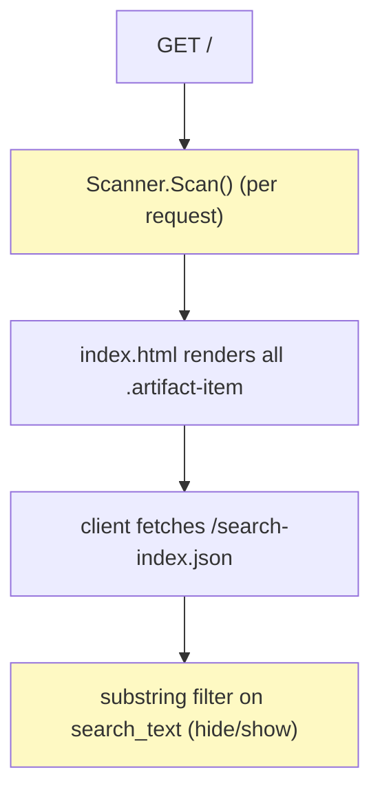
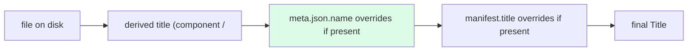
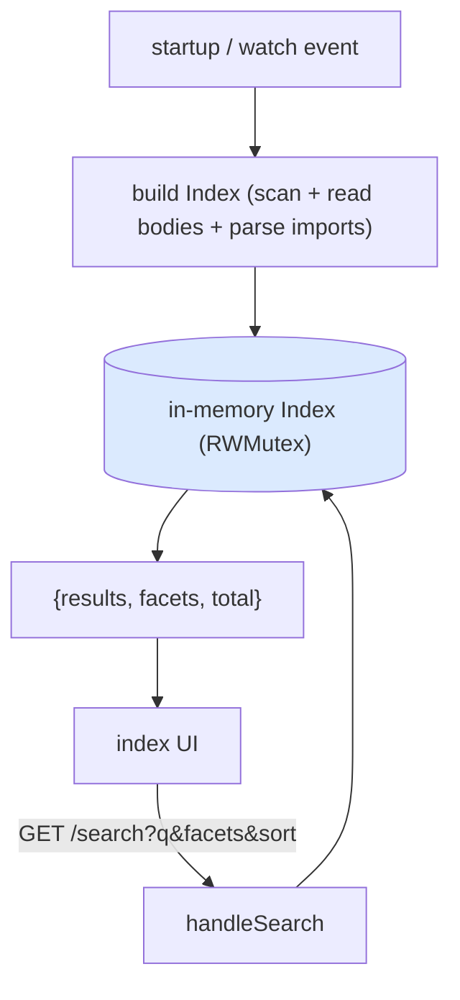

# Export Metadata Ingest and Search: Analysis, Design and Implementation Guide

This guide is for an engineer who has not worked on `serve-artifacts` before and needs to implement two features: making each artifact carry the metadata its source conversation already has, and making thousands of artifacts searchable and filterable. Both features build on the same small foundation — the directory scanner — so this guide first explains what exists, then designs the two additions against it.

The two features are deliberately paired. Ingesting metadata (feature 1) is what gives search (feature 2) something worth searching and filtering on: without it, most artifacts have a title like `App` and no project, model, date, or tags. With it, every artifact carries the title, project, model, dates, and warnings of the conversation that produced it, and search and facets become genuinely useful.

> [!summary]
> - `serve-artifacts` scans a directory of `.jsx`/`.html` files and serves each one; JSX is compiled in the browser. Metadata today comes only from optional per-file `*.manifest.json` companions, so most artifacts fall back to a component name for a title.
> - The bulk conversation exporter writes a `meta.json` per conversation (`<uuid>/meta.json`) next to an `artifacts/` folder. Feature 1 associates each artifact under `<uuid>/artifacts/` with that `meta.json` and enriches it with conversation title, project, model, dates, reconstruction warnings, and a transcript link.
> - Feature 2 adds a cached in-memory search index (rebuilt on file-watch events), full-text over title/description/tags/source/transcript, faceted filtering (type, project, model, tags, library, has-warning), and sorting, exposed through a `/search` JSON endpoint and a rebuilt index UI.
> - Precedence for any field: explicit `*.manifest.json` wins, then ingested `meta.json`, then values derived from the file itself. This keeps existing manifest-annotated demos working unchanged.

## Part I — The system as it exists

### 1.1 What the server does

`serve-artifacts` is a Go server built on the Glazed command framework. Its `serve` command scans a directory for artifact files and serves them over HTTP. HTML artifacts are served directly with a small injected navigation bar. JSX artifacts are served through a host page that loads React via an import map and compiles the JSX in the browser (precompiled bundle for known demos, Babel-standalone fallback for new files), then mounts the default export into `#root`.

The request surface (`pkg/server/server.go`):

| Route | Handler | Purpose |
|---|---|---|
| `GET /{$}` | `handleIndex` | HTML index of all artifacts |
| `GET /search-index.json` | `handleSearchIndex` | JSON array of search documents |
| `GET /view/{name...}` | `handleView` | Render one artifact (HTML direct, JSX via host page) |
| `GET /jsx/{name...}` | `handleJSX` | JSX source + auto-mount code (Babel path) |
| `GET /compiled/{name...}` | `handleCompiledJSX` | Precompiled JS for known demos |
| `GET /raw/{name...}` | `handleRaw` | Raw file bytes |
| `GET /events` | watcher SSE | Live-reload when `--watch` |

### 1.2 The data model

The unit is `artifacts.Artifact` (`pkg/artifacts/scanner.go`):

```go
type Artifact struct {
    Name          string    // slash path relative to root, no extension (the URL key)
    Filename      string
    Type          string    // "html" | "jsx"
    Title         string    // manifest title, else component/HTML-title, else Name
    Size          int64
    ModifiedAt    time.Time
    Path          string    // absolute path on disk
    Description   string    // from manifest
    Tags          []string  // from manifest
    OriginalDate  string    // from manifest, YYYY-MM-DD
    Links         []ArtifactLink
    ManifestPath  string
    HasManifest   bool
    ManifestError string
}
```

The `Scanner` (`pkg/artifacts/scanner.go`) walks the directory tree recursively. For each `.jsx`/`.html` file it computes `Name` as the slash-path relative to the root without extension (so `abc123/artifacts/Calendar.jsx` → `abc123/artifacts/Calendar`), extracts a title (HTML `<title>` or JSX default-export component name), and, if a sibling `<base>.manifest.json` exists, overlays the manifest fields. Manifests are the only metadata source today; they are described in `pkg/artifacts/manifest.go` (`ArtifactManifest`: title, description, tags, original_date, links).

Two properties matter for the features below. First, `Scan()` runs **on every request** — there is no cache. Second, the search layer (`pkg/server/search.go`) builds one `SearchDocument` per artifact with a `search_text` field that concatenates and lowercases name, title, description, filename, type, date, and tags — but **not** the artifact's source code.

### 1.3 The current search UX

`pkg/server/templates/index.html` renders every artifact server-side as an `.artifact-item`, and a client script fetches `/search-index.json` and hides items whose `search_text` does not contain the query substring. It is explicitly a first-pass local filter: no facets, no sorting, no full-text over source, and it renders all items up front (fine for dozens, not for thousands).



## Part II — The input: the claude export format

The bulk exporter (`surf claude export-all` in the `surf-cli` repo) writes, per conversation:

```
<out>/<conversation-uuid>/
    conversation.md       # human-readable transcript
    conversation.json     # structured slim payload
    meta.json             # metadata (the thing feature 1 ingests)
    artifacts/
        Calendar.jsx
        page.html
        ...
```

`meta.json` looks like:

```json
{
  "uuid": "f3d43330-56ed-4bc1-aa27-b0dc9d31ee4e",
  "name": "Minimal timezone-aware calendar",
  "model": "claude-opus-4-8",
  "created_at": "2026-07-06T17:03:21Z",
  "updated_at": "2026-07-06T17:40:00Z",
  "project_uuid": null,
  "artifacts": [
    { "file": "artifacts/Calendar.jsx", "path": "/mnt/user-data/outputs/Calendar.jsx", "bytes": 10233, "source": "file-tool" }
  ],
  "warnings": []
}
```

The key relationship: an artifact on disk at `<uuid>/artifacts/<file>` is described by the `meta.json` two directories up (`<uuid>/meta.json`), and its entry in `meta.json.artifacts[]` is the one whose `file` equals its path relative to the conversation directory. That relationship is what feature 1 exploits.

## Part III — Feature 1: ingest export metadata

### 3.1 Goal

Every artifact that came from an export should inherit the conversation's identity so the library is browsable and searchable: a real title, its project, model, dates, any reconstruction warnings, and a link to the transcript. Artifacts that are not part of an export (a hand-dropped `.jsx`, a manifest-annotated demo in `imports/`) must keep working exactly as before.

### 3.2 New fields on `Artifact`

Add source/provenance fields (all optional; empty when the artifact is not from an export):

```go
// provenance (from the export's meta.json)
SourceConversationUUID  string
SourceConversationTitle string
Project                 string    // project_uuid (or resolved name if available)
Model                   string
ConversationCreatedAt   string
ConversationUpdatedAt   string
TranscriptPath          string    // abs path to <uuid>/conversation.md
ClaudeURL               string    // https://claude.ai/chat/<uuid>
Warnings                []string  // reconstruction warnings for THIS artifact's conversation
FromExport              bool
```

### 3.3 Association algorithm

During the recursive walk, when a file's path contains an `artifacts/` segment, look for a `meta.json` in the parent of that `artifacts/` directory, parse and cache it, and match the file to its entry.

```
during Scan(), for each artifact file at abs path P with root-relative REL:
    # is it in an export? REL looks like ".../<uuid>/artifacts/<file>"
    convDir = dir(dir(P))                       # parent of the artifacts/ dir
    metaPath = convDir + "/meta.json"
    if exists(metaPath):
        meta = loadMetaJSON(metaPath)           # cache by convDir; parse once
        entry = meta.artifacts[ file whose "file" == relpath(P, convDir) ]  # e.g. "artifacts/Calendar.jsx"
        enrich(artifact, meta, entry)

enrich(a, meta, entry):
    a.FromExport = true
    a.SourceConversationUUID = meta.uuid
    a.SourceConversationTitle = meta.name
    a.Project = meta.project_uuid
    a.Model = meta.model
    a.ConversationCreatedAt = meta.created_at
    a.ConversationUpdatedAt = meta.updated_at
    a.TranscriptPath = convDir + "/conversation.md"   (if exists)
    a.ClaudeURL = "https://claude.ai/chat/" + meta.uuid
    a.Warnings = meta.warnings
    if a.OriginalDate == "": a.OriginalDate = date(meta.created_at)   # YYYY-MM-DD
```

### 3.4 Title precedence

Title resolution becomes a three-level fallback. This ordering is the crux of keeping existing behavior intact:

1. **Manifest title** — an explicit `*.manifest.json` `title` (highest; unchanged behavior for annotated demos).
2. **Conversation title** — `meta.json.name` (new; the big improvement for exports — "Minimal timezone-aware calendar" instead of "Calendar" or "App").
3. **Derived title** — HTML `<title>` or JSX component name (existing fallback).
4. **`Name`** — last resort.

Because the manifest overlay already runs last in the scanner, implement this by applying the `meta.json` enrichment *before* the manifest overlay, and by only setting `Title` from `meta.json.name` when no manifest title is present.



### 3.5 Where the data flows

- `Artifact` gains the fields (§3.2) — `pkg/artifacts/scanner.go`.
- A small `loadMetaJSON` + `meta.json` struct — new, in `pkg/artifacts` (mirror `manifest.go`).
- `SearchDocument` (`pkg/server/search.go`) gains `project`, `model`, `source_uuid`, `warnings_count`, and the enriched fields feed `search_text`.
- The index template and view page show the new fields (project chip, model, date, a "transcript"/"open in claude.ai" link, a warning badge when `len(Warnings) > 0`).

### 3.6 Testing feature 1

Unit-test the scanner against a temp tree mirroring the export layout: a `<uuid>/meta.json` with a name/project/model and a `<uuid>/artifacts/X.jsx`; assert the artifact's `Title` is the conversation name, `Project`/`Model` are set, `FromExport` is true, and warnings propagate. Add a case with a competing `X.manifest.json` title to confirm the manifest still wins. Add a case with no `meta.json` to confirm the derived title is unchanged.

## Part IV — Feature 2: search & discovery

### 4.1 Goal and shape

Turn the first-pass substring filter into real search over thousands of artifacts: full-text (including source and transcript), faceted filtering, and sorting. Keep it a single-binary, no-external-service design. Do the filtering in Go (server-side) so full-text can include source code without shipping every file to the browser, and so the work scales.

### 4.2 A cached in-memory index

`Scan()` runs per request and does not read source bodies; both are unacceptable for full-text search at scale. Introduce a cached index, rebuilt on watcher events (the watcher already exists for live-reload):

```go
type IndexEntry struct {
    Artifact  artifacts.Artifact
    Body      string   // lowercased source (jsx/html) for full-text
    Transcript string  // lowercased conversation.md, if present
    Libraries []string // bare import specifiers (recharts, d3, ...) parsed from source
}

type Index struct {
    mu      sync.RWMutex
    entries []IndexEntry
    // precomputed facet value -> count, for fast facet rendering
}
```

Build it once at startup and rebuild on `fsnotify` events (debounced). Serving reads under `RLock`. This also removes per-request scanning for the index page.

### 4.3 Query model and the `/search` endpoint

Add `GET /search` returning JSON:

Request (all optional): `q` (free text), `type`, `project`, `model`, `tag` (repeatable), `library`, `warnings=true`, `sort` (`recent|title|size|-size`), `limit`, `offset`.

```json
{
  "total": 128,
  "results": [ { "name": "...", "title": "...", "type": "jsx", "project": "...",
                 "model": "...", "tags": ["..."], "view_url": "/view/...",
                 "updated_at": "...", "warnings_count": 0 } ],
  "facets": {
    "type":    { "jsx": 100, "html": 28 },
    "project": { "EINK-OS": 12, "(none)": 40 },
    "model":   { "claude-opus-4-8": 90 },
    "library": { "recharts": 3, "d3": 5 },
    "tag":     { "chart": 7 }
  }
}
```

Matching:

```
matches(entry, q, filters):
    if type filter set and entry.Type != type: return false
    if project set and entry.Project != project: return false
    if model set and entry.Model != model: return false
    for t in tags filter: if t not in entry.Tags: return false
    if library set and library not in entry.Libraries: return false
    if warnings==true and len(entry.Warnings)==0: return false
    if q != "":
        hay = title + description + tags + name + body + transcript   (all lowercased)
        for term in tokenize(q): if term not in hay: return false     # AND semantics
    return true

facets = counts of each facet value across the FILTERED-except-that-facet set
sort results by `sort`
return page [offset, offset+limit)
```

Facet counts are computed so that selecting one value of a facet does not zero out the other values of the same facet (standard faceted-search behavior): count each facet against the result set filtered by all *other* facets.

### 4.4 UI

Rebuild `index.html` around the endpoint:

- A **search box** that debounces and calls `/search`.
- A **facet sidebar**: type, project, model, tag, library, "has warnings" — each value a checkbox/link with its count; selecting updates the query string and re-queries.
- A **sort** dropdown (recent / title / size).
- A **result count** and **pagination** (or windowed infinite scroll) so the page never renders thousands of nodes at once.
- Cards show title, project chip, model, date, tags (clickable → adds tag facet), a warning badge, and links to view / transcript / claude.ai.

The page can keep working without JS by falling back to a server-rendered first page, but the interactive path is the `/search` endpoint.



### 4.5 Library extraction

Facet "library" comes from parsing each source's bare import specifiers (a specifier that is not relative and not `react`/`react-dom`). Reuse a simple regex over the source: `from ['"]([^./][^'"]*)['"]`, drop `react*`, keep the rest. This both powers the facet and feeds the import-map completeness idea (an artifact importing a library the host page's import map lacks will fail to render — surfacing it here makes that visible).

### 4.6 Testing feature 2

- Unit-test `matches` and facet counting on a small synthetic corpus: term AND semantics, type/project/tag/library filters, warnings filter, and that facet counts exclude their own facet.
- Unit-test library extraction (named vs default imports, relative excluded, react excluded).
- Endpoint test: `/search?q=...&type=jsx&sort=title` returns the right subset in the right order with correct `total` and `facets`.

## Part V — Implementation sequence

1. **Feature 1 first** — it is smaller and it is what makes feature 2 worth building.
   1. Add the provenance fields to `Artifact` and a `meta.json` loader in `pkg/artifacts`.
   2. Wire the association + enrichment into `Scan()`; apply title precedence.
   3. Surface the fields in `SearchDocument`, the index card, and the view page. Add tests.
   4. Commit.
2. **Feature 2** — build on the enriched artifacts.
   1. Add the cached `Index` and rebuild-on-watch.
   2. Add the `/search` endpoint (matching, facets, sort, paging) + tests.
   3. Rebuild the index UI around `/search`. Add library extraction.
   4. Commit.

Keep the diary (`reference/02-diary.md`) updated as you go: what was tried, what worked, what to do next.

## Appendix A — API reference

- `GET /search-index.json` (existing) — array of `SearchDocument`; enriched in feature 1.
- `GET /search?q=&type=&project=&model=&tag=&library=&warnings=&sort=&limit=&offset=` (new, feature 2) — `{total, results, facets}` as in §4.3.
- Existing routes unchanged: `/`, `/view/{name...}`, `/jsx/{name...}`, `/compiled/{name...}`, `/raw/{name...}`, `/events`.

## Appendix B — File reference

| File | Role / change |
|---|---|
| `pkg/artifacts/scanner.go` | `Artifact` struct + recursive `Scan()`; add provenance fields, `meta.json` association, title precedence. |
| `pkg/artifacts/manifest.go` | Manifest model; mirror it for a `meta.json` loader. |
| `pkg/server/search.go` | `SearchDocument` + `buildSearchText`; enrich, and add the `Index`, `matches`, and facet logic (or a new `pkg/server/index.go`). |
| `pkg/server/server.go` | Handlers + routes; add `handleSearch`, build/hold the `Index`, rebuild on watch. |
| `pkg/server/watcher.go` | File watcher; trigger index rebuild on change. |
| `pkg/server/templates/index.html` | Rebuild UI around `/search` (facets, sort, paging). |
| `pkg/server/templates/jsx-host.html` | View page; show provenance (transcript / claude.ai links, warning badge). |

## Appendix C — Failure modes

| Symptom | Cause | Handling |
|---|---|---|
| Artifact from export still titled `App` | `meta.json` not associated | Verify the `<uuid>/artifacts/<file>` → `<uuid>/meta.json` path logic; the file's `meta.json.artifacts[].file` must match its relative path. |
| Manifest title overridden by conversation name | Precedence wrong | meta.json enrichment must not overwrite a manifest title (§3.4). |
| Slow index page at scale | Per-request scan + body reads | Cache the `Index`; rebuild only on watch events (§4.2). |
| Facet value disappears when selected | Facet counted against its own filter | Count each facet against the result set filtered by all *other* facets (§4.3). |
| Full-text misses source matches | `search_text` excludes body | Include lowercased source (and transcript) in the index body (§4.2), matched server-side. |
| Huge `/search-index.json` | Shipping full source to client | Keep full-text server-side; the JSON carries only display fields, not bodies. |
