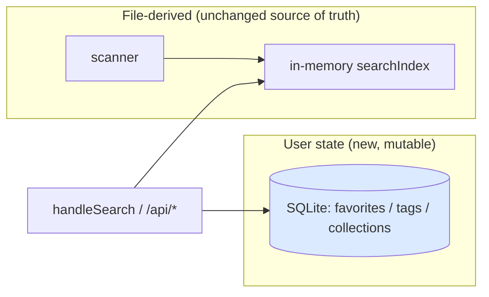
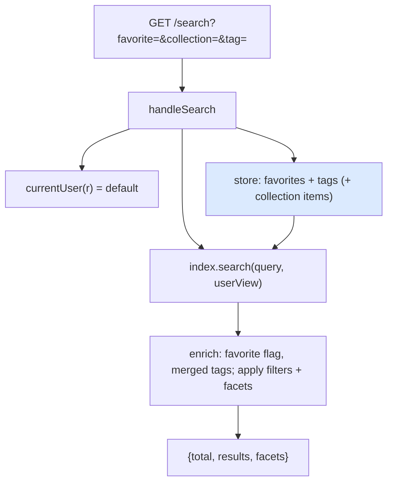

# Favorites, Tags and Collections: Analysis, Design and Implementation Guide

This guide is for an engineer implementing the third organization feature of `serve-artifacts`: letting a user mark artifacts as favorites, apply their own tags, and group artifacts into collections (playlists). Unlike the previous two features — which derived everything from files on disk — this one introduces **mutable state that belongs to a user**. That single fact drives the whole design: it means a persistent store, and it means every row of that state is scoped to a user.

The product requirement has a specific shape. We must **design the schema for many users now**, but there is no identity provider yet, so **the current user is hardcoded to a single "default" account**. The design must make swapping in a real IdP later a small, localized change — not a schema migration and not a rewrite. The mechanism for that is one function, `currentUser()`, and a `user_id` column on every user-owned table.

> [!summary]
> - Artifacts remain file-derived (the scanner and the in-memory search index are unchanged as the source of truth for *what exists*). User data — favorites, tags, collection membership — lives in a new **SQLite** store (`mattn/go-sqlite3`, already in the module graph).
> - Every user-owned table has a `user_id` column. Today `currentUser(r)` returns the constant `"default"`; a real IdP later changes only that function. No schema change is needed to go multi-user.
> - `/search` enriches each result with the current user's `favorite` flag and merged tags, and gains `favorite=true`, `collection=<id>`, and user-tag filters. New `/api/*` endpoints mutate favorites/tags/collections.
> - Artifacts are referenced by their stable `Name` (the slash path relative to the serve root, without extension) — the same key `/view/{name...}` already uses — so user data joins to artifacts without an artifacts table.
> - Build order: store + schema first (task 1), then favorites (2), user tags (3), collections (4). Each is a vertical slice: store method → API → search/UI.

## Part I — The system as it exists

Two prior features are the substrate:

- **The scanner** (`pkg/artifacts/scanner.go`) walks the artifact directory and produces `artifacts.Artifact` values, each with a `Name` that is the slash path relative to the serve root without extension (e.g. `abc123/artifacts/Calendar`). This `Name` is the artifact's stable identity and the key used by `/view/{name...}`.
- **The search index** (`pkg/server/index.go`) is a cached, in-memory `searchIndex` rebuilt at startup and on file-watch. `handleSearch` (`pkg/server/server.go`) answers `GET /search` with `{total, results, facets}`; the index page and `/search-index.json` also read this cache. `SearchDocument` (`pkg/server/search.go`) is the per-artifact result shape.

Nothing in this substrate is mutable at runtime, and nothing is user-specific. This feature adds both, and keeps them in a separate layer so the file-derived layer stays simple.



## Part II — The core decisions

### 2.1 Why a persistent store, and why SQLite

Favorites, tags, and collections are user edits; they must survive restarts and must not live in a file the scanner would try to serve. A database is the right home. SQLite is the right database here: it is a single file, needs no server, and `github.com/mattn/go-sqlite3` is already a (transitive) dependency, so it adds no new module. It matches the project's "single self-contained binary" ethos. (CGO is enabled in this environment; a pure-Go driver like `modernc.org/sqlite` is a drop-in alternative if a cgo-free build is ever required.)

### 2.2 Multi-user schema, single hardcoded user

The schema is multi-user from the start: a `users` table and a `user_id` column on `favorites`, `artifact_tags`, and `collections`. But identity is resolved through exactly one function:

```go
const DefaultUserID = "default"

// currentUser resolves the acting user. Today it always returns the default
// account; a real IdP later reads a session cookie / bearer token here and this
// is the ONLY place that changes.
func currentUser(r *http.Request) string { return DefaultUserID }
```

At startup the store seeds the default user (`INSERT OR IGNORE INTO users`). Every query filters by `user_id`, so the data is already partitioned; going multi-user is a change to `currentUser` plus a login flow, not a migration.

### 2.3 Referencing artifacts by Name

User data does not get an artifacts table. It references artifacts by their `Name` (`artifact_key`). `Name` is stable (path-derived), already unique within a serve root, and already the routing key. This keeps the store independent of the scan: a favorite is `(user_id, artifact_key)`, valid whether or not the file is currently present. If a file is later removed, its user data is simply orphaned (harmless; a future GC can prune keys not in the index).

## Part III — The schema

```sql
CREATE TABLE IF NOT EXISTS users (
  id           TEXT PRIMARY KEY,
  display_name TEXT,
  created_at   TEXT NOT NULL
);

CREATE TABLE IF NOT EXISTS favorites (
  user_id      TEXT NOT NULL,
  artifact_key TEXT NOT NULL,
  created_at   TEXT NOT NULL,
  PRIMARY KEY (user_id, artifact_key)
);

CREATE TABLE IF NOT EXISTS artifact_tags (
  user_id      TEXT NOT NULL,
  artifact_key TEXT NOT NULL,
  tag          TEXT NOT NULL,
  created_at   TEXT NOT NULL,
  PRIMARY KEY (user_id, artifact_key, tag)
);

CREATE TABLE IF NOT EXISTS collections (
  id         INTEGER PRIMARY KEY AUTOINCREMENT,
  user_id    TEXT NOT NULL,
  name       TEXT NOT NULL,
  created_at TEXT NOT NULL,
  UNIQUE (user_id, name)
);

CREATE TABLE IF NOT EXISTS collection_items (
  collection_id INTEGER NOT NULL,
  artifact_key  TEXT NOT NULL,
  position      INTEGER NOT NULL,
  created_at    TEXT NOT NULL,
  PRIMARY KEY (collection_id, artifact_key),
  FOREIGN KEY (collection_id) REFERENCES collections(id) ON DELETE CASCADE
);
```

Notes:

- **Tags are denormalized** as `(user_id, artifact_key, tag)` rows rather than a `tags` table + join table. This keeps add/remove trivial and "all my tags" a `SELECT DISTINCT tag`. A normalized model (with global rename) can come later if needed.
- **Collections are ordered** via an integer `position`; a new item gets `MAX(position)+1`; reorder rewrites positions.
- `PRAGMA foreign_keys = ON` must be set per connection for the `ON DELETE CASCADE` to fire.
- Migrations are `CREATE TABLE IF NOT EXISTS` run at `Open()` — no migration framework needed yet.

## Part IV — The store package (`pkg/userdata`)

A thin, well-tested wrapper around `*sql.DB`. Signatures (abridged):

```go
type Store struct { db *sql.DB }

func Open(path string) (*Store, error)   // opens sqlite, PRAGMA fk=ON, migrate, seed default user
func (s *Store) EnsureUser(id, displayName string) error

// favorites
func (s *Store) SetFavorite(user, key string, on bool) error
func (s *Store) Favorites(user string) (map[string]bool, error)   // set, for the index

// tags
func (s *Store) AddTag(user, key, tag string) error
func (s *Store) RemoveTag(user, key, tag string) error
func (s *Store) TagsByArtifact(user string) (map[string][]string, error)  // bulk, for the index
func (s *Store) AllTags(user string) ([]string, error)

// collections
type Collection struct { ID int64; Name string; Count int }
func (s *Store) CreateCollection(user, name string) (int64, error)
func (s *Store) ListCollections(user string) ([]Collection, error)
func (s *Store) DeleteCollection(user string, id int64) error
func (s *Store) AddToCollection(user string, id int64, key string) error   // position = max+1; verifies ownership
func (s *Store) RemoveFromCollection(user string, id int64, key string) error
func (s *Store) ReorderCollection(user string, id int64, keys []string) error
func (s *Store) CollectionItems(user string, id int64) ([]string, error)   // ordered keys
```

Every collection mutation checks ownership (`WHERE user_id = ?` on the `collections` row) so one user cannot touch another's collection even once auth exists.

## Part V — HTTP API

Mutations are small POST/DELETE endpoints under `/api`; the acting user is always `currentUser(r)`. Parameters can be query/form values (curl-friendly) returning JSON.

| Method + path | Body/params | Returns |
|---|---|---|
| `POST /api/favorite` | `key`, `on=true\|false` (omit `on` = toggle) | `{key, favorite}` |
| `POST /api/tags/add` | `key`, `tag` | `{key, tags:[...]}` |
| `POST /api/tags/remove` | `key`, `tag` | `{key, tags:[...]}` |
| `GET /api/collections` | — | `[{id,name,count}]` |
| `POST /api/collections` | `name` | `{id,name}` |
| `DELETE /api/collections/{id}` | — | `{ok}` |
| `POST /api/collections/{id}/items` | `key` | `{ok}` |
| `DELETE /api/collections/{id}/items` | `key` | `{ok}` |
| `POST /api/collections/{id}/reorder` | `keys` (repeatable/CSV) | `{ok}` |

Existing routes are unchanged; `/search` gains query params (Part VI).

## Part VI — Folding user data into search

`/search` is where organization becomes useful. Per request, `handleSearch` loads the current user's small state and passes it to the index:

```
handleSearch(r):
    user = currentUser(r)
    fav      = store.Favorites(user)          # set of keys
    userTags = store.TagsByArtifact(user)     # key -> []tag
    colKeys  = (query.collection set?) store.CollectionItems(user, id) as set : nil
    result   = index.search(query, userView{fav, userTags, colKeys})
    return result
```

`index.search` enriches and filters using that view:

- **Enrich** each result: `favorite = fav[key]`; `tags = manifestTags ∪ userTags[key]` (deduped).
- **Filter**: `favorite=true` keeps only favorites; `collection=<id>` keeps only `colKeys`; a `tag=X` filter now matches the merged tag set.
- **Facets**: the `tag` facet counts merged tags; add a `favorites` count to the response so the UI can show "★ Favorites (N)".

Because favorites/tags are per-user and cheap (tens to thousands of rows), loading them per request is fine; no need to bake them into the cached index (which is shared across users and rebuilt only on file change). Keeping user data *out* of the shared index is also what makes multi-user correct later: the index stays user-agnostic, the per-request view supplies identity.



## Part VII — UI

Additions to `templates/index.html`, all talking to `/api/*` then re-running the current `/search`:

- **Favorite star** on each card; click → `POST /api/favorite` → re-query. A "★ Favorites" facet/toggle filters to favorites.
- **Tag editing** on a card: existing tags as removable chips (× → `POST /api/tags/remove`) and a small "+tag" input (→ `POST /api/tags/add`). User tags render alongside manifest tags (optionally styled differently).
- **Collections**: a sidebar section listing collections (name + count); clicking one sets `collection=<id>` (a filtered view); a "＋ New collection" control; on a card, an "add to collection" menu. Deleting/reordering are secondary.

Keep the plain, un-chromed styling introduced previously.

## Part VIII — Implementation sequence

1. **Store + schema (task 1)** — `pkg/userdata` with `Open/EnsureUser` and the schema; unit tests against a temp DB (favorites toggle, tag add/remove/list, collection create/add/reorder/delete-cascade, ownership isolation). Add the `--db` flag (default under the user config dir) and open the store in `serve`. Commit.
2. **Favorites (task 2)** — `POST /api/favorite`; enrich + `favorite=true` filter + favorites count in `/search`; star control in the UI. Commit.
3. **User tags (task 3)** — add/remove endpoints; merge into tag facet/filter; card tag editor. Commit.
4. **Collections (task 4)** — collection endpoints; `collection=<id>` filter; collections sidebar + add-to-collection. Commit.

Keep the diary (`reference/02-diary.md`) in the strict diary-skill step format as each task lands.

## Appendix A — API reference

- Mutations: the `/api/*` table in Part V.
- `GET /search?...&favorite=true&collection=<id>&tag=<t>` — adds favorite/collection filters and merged-tag matching to the existing query (see the metadata/search guide for the base parameters).
- Response additions: each `SearchDocument` gains `favorite` (bool) and merged `tags`; the `facets` object gains a `favorites` count.

## Appendix B — File reference

| File | Role / change |
|---|---|
| `pkg/userdata/store.go` (new) | SQLite store: schema, `Open`, `EnsureUser`, favorites/tags/collections methods. |
| `pkg/userdata/store_test.go` (new) | Store unit tests against a temp DB. |
| `pkg/server/server.go` | `currentUser` seam; open the store; register `/api/*`; wire the user view into `handleSearch`. |
| `pkg/server/index.go` | `search` accepts a per-user view; enrich favorite/merged tags; add favorite/collection filters and favorites facet. |
| `pkg/server/search.go` | `SearchDocument` gains `favorite` + merged tags. |
| `pkg/server/templates/index.html` | Star, tag editor, collections sidebar. |
| `cmd/serve-artifacts/...` | `--db` flag on `serve`. |
| `go.mod` | promote `mattn/go-sqlite3` to a direct dependency. |

## Appendix C — Failure modes

| Symptom | Cause | Handling |
|---|---|---|
| Cascade delete of collection items doesn't fire | `PRAGMA foreign_keys` off | Set `PRAGMA foreign_keys = ON` per connection in `Open`. |
| One user edits another's collection (post-IdP) | Missing ownership filter | Every collection mutation filters `WHERE user_id = ?`. |
| DB written into a read-only export dir | Default path in the served dir | Default `--db` to the user config/state dir, not the artifact dir. |
| Favorites/tags vanish after re-scan | Stored in the volatile index | User data lives in SQLite keyed by `Name`, never in the in-memory index. |
| Going multi-user needs a migration | Identity baked into rows | It doesn't: `user_id` already exists; only `currentUser` changes. |
| Duplicate favorite/tag errors | Re-inserting a PK | Use `INSERT OR IGNORE` (favorites/tags) and treat toggle idempotently. |
