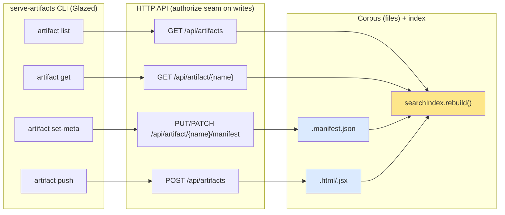
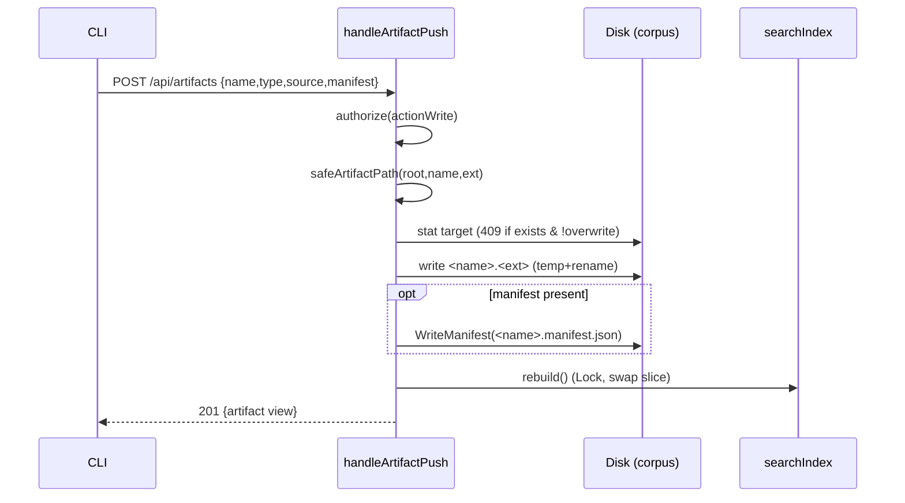
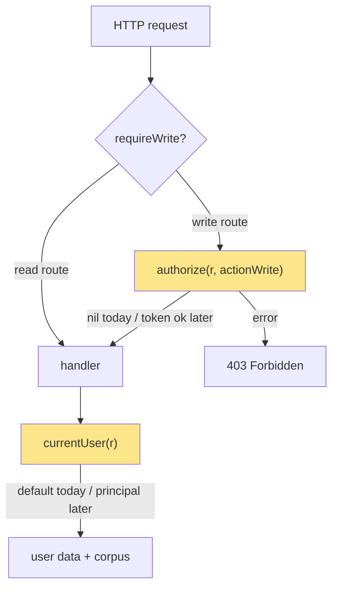

# Artifact Management API and Glazed CLI: Analysis, Design and Implementation Guide

This guide is for an engineer joining the `serve-artifacts` project to build two connected things: an **HTTP API for managing artifacts** — listing them, viewing one, modifying an artifact's metadata, and pushing a new artifact into the corpus — and a set of **command-line verbs**, written with the Glazed framework, that drive that API from a terminal. The API is expected to be **protected for authorized users later**; the design must make that protection a small, contained change rather than a rewrite, exactly the way the existing per-user data layer made multi-user support a contained change.

To build this well you need to understand three separate concerns that already exist in the codebase and are easy to conflate: the **artifact corpus** (files on disk that the scanner reads), the **in-memory search index** (a cached projection of the corpus that every read endpoint answers from), and the **per-user state** (favorites, tags, collections, in SQLite). The new API writes to the *corpus* — a place nothing has written to at runtime before — and must then refresh the *index*. It does not touch per-user state. Keeping these three straight is the single most important thing for getting the design right, so this guide starts there.

> [!summary]
> - The artifact **corpus** is files on disk. The scanner (`pkg/artifacts/scanner.go`) reads it into `artifacts.Artifact` values; the in-memory `searchIndex` (`pkg/server/index.go`) caches a derived view that every read endpoint answers from. Nothing has written to the corpus at runtime until now.
> - **Modify** = write a **manifest sidecar** (`<basename>.manifest.json`, the `artifacts.ArtifactManifest` shape) next to the artifact. It changes metadata (title, description, tags, original date, links) without touching the source. **Push** = write a **new artifact file** (`.html`/`.jsx`) into the serve directory, optionally with a manifest. Both must trigger `index.rebuild()` so reads see the change immediately.
> - Editing a manifest does **not** change the artifact's `contentHash` (that hashes the *source*), so the thumbnail stays valid. Pushing new source produces a new hash and thus a fresh thumbnail on next request — the cache invalidation is automatic.
> - **Authorization is a seam, not a feature yet.** Add one `authorize(r, action)` function, mirror the existing `currentUser(r)` pattern, route every mutating handler through it, and have it allow everything today. A real bearer-token / IdP check later changes only that function plus a middleware — no route or handler rewrites.
> - The **CLI** verbs are HTTP clients, not in-process calls. They share one small `apiClient` (base URL from `--api` / `SERVE_ARTIFACTS_API`, future `--token`). `list`/`get` are Glazed commands emitting structured rows; `set-meta`/`push` are writer commands that POST/PATCH and print the server's response. This matches how `cmd/serve-artifacts/cmds/list.go` is already written.
> - Build order is vertical slices: index-rebuild-on-write plumbing → read API (`list`/`get`) → `modify` (manifest writer) → `push` (file writer) → auth seam → CLI verbs. Each slice is shippable on its own.

## Part I — The system as it exists

Four pieces of the current system matter for this work. Read this part even if you have seen the code, because the new API's correctness depends on the exact contracts between them.

### 1.1 The corpus and the scanner

The corpus is a directory tree of artifact files. An artifact is an `.html`/`.htm` or `.jsx` file. The scanner walks that tree and produces one `artifacts.Artifact` per file (`pkg/artifacts/scanner.go`). The field that matters most is `Name`: it is the artifact's slash-separated path relative to the serve root, **without the extension**. A top-level `business-app.jsx` has `Name` `business-app`; a nested `abc123/artifacts/Calendar.jsx` has `Name` `abc123/artifacts/Calendar`. This `Name` is the artifact's stable identity across the whole system — it is the key in every URL (`/view/{name...}`, `/api/artifact/{name...}`) and the key that per-user data joins against. The API you are building uses the same key.

Two kinds of sidecar files enrich an artifact during the scan:

- A **manifest**, `<basename>.manifest.json`, matched to the artifact by the same relative key with the `.manifest.json` suffix stripped. It carries editable metadata. This is the file the **modify** endpoint writes.
- An **export `meta.json`**, present when the artifact lives at `<uuid>/artifacts/<file>`; it carries conversation provenance (title, model, dates, the source `claude.ai` URL). The API does not write this.

### 1.2 The manifest — the metadata you will write

The manifest is the only editable metadata surface, so understand its shape precisely (`pkg/artifacts/manifest.go`):

```go
type ArtifactManifest struct {
    Title        string         `json:"title"`
    Description  string         `json:"description"`
    Tags         []string       `json:"tags"`
    OriginalDate string         `json:"original_date"` // YYYY-MM-DD
    Links        []ArtifactLink `json:"links"`         // {label, url}, http(s) only
}
```

Loading is strict: `loadManifest` uses `DisallowUnknownFields`, rejects trailing JSON, and runs `validateManifest`, which enforces that a present title is non-blank, tags contain no blank values, `original_date` (if set) parses as `YYYY-MM-DD`, and every link has a non-blank label and an `http`/`https` URL. It trims whitespace on title, description, tags, and links as a side effect. **Your writer must produce JSON that passes this same validation**, because the next scan will re-read it and a validation failure is surfaced as `ManifestError` on the artifact rather than applied.

Application precedence, from `applyManifest`, is worth memorizing because it explains what a modify can and cannot override:

```go
func applyManifest(a *Artifact, m *ArtifactManifest) {
    if m.Title != "" { a.Title = m.Title } // empty title does NOT clear a derived title
    a.Description = m.Description           // description/tags/date/links overwrite unconditionally
    a.Tags = append([]string(nil), m.Tags...)
    a.OriginalDate = m.OriginalDate
    a.Links = append([]ArtifactLink(nil), m.Links...)
}
```

The manifest overlay runs *after* export-`meta.json` enrichment, so a manifest title wins over the conversation name, which in turn wins over an HTML-`<title>`/JSX-component-derived title. An empty manifest title is not "clear the title"; it is "fall back to the derived title." Your `modify` API must decide, and document, whether it does a **replace** (write the whole manifest) or a **merge** (patch individual fields); §3.4 recommends both, mapped to `PUT` and `PATCH`.

### 1.3 The in-memory index — what every read answers from

No read endpoint scans the disk per request. At startup (and on file-watch events) `searchIndex.rebuild()` re-scans the corpus, reads each artifact's source (and transcript) to build a lowercased full-text `haystack`, computes a `contentHash` of the source, extracts imported libraries, and stores everything in a slice guarded by an `sync.RWMutex` (`pkg/server/index.go`). Reads take an `RLock`; a rebuild swaps the slice under a `Lock`.

Two consequences drive the write API:

- **A write to the corpus is invisible until the index is rebuilt.** After the API writes a manifest or a new file, it must call `index.rebuild()` (or the file-watcher must fire). Relying on the watcher alone is a race — the HTTP response would return before the change is queryable. The API should rebuild explicitly and synchronously before responding.
- **`contentHash` is a hash of the source only** (`contentHash(body)` over the file bytes). It is the thumbnail cache key: `<hash>.png`. A **modify** (manifest edit) leaves the source untouched, so the hash is unchanged and the existing thumbnail stays correct — which is what you want, because metadata does not change how the artifact renders. A **push** creates a new source with a new hash whose thumbnail is simply missing, so it regenerates lazily on first request. You never invalidate thumbnails by hand.

### 1.4 The read surface and the two mutation layers today

The router (`pkg/server/server.go`, `Server.Run`) already exposes a read surface and a *user-data* mutation surface:

| Concern | Endpoint | Handler | Writes to |
|---|---|---|---|
| Search / list | `GET /search` | `handleSearch` | nothing (reads index) |
| View one (JSON) | `GET /api/artifact/{name...}` | `handleArtifactJSON` | nothing |
| View / raw source | `GET /view/{name...}`, `GET /raw/{name...}` | `handleView`, `handleRaw` | nothing |
| Favorite | `POST /api/favorite` | `handleFavorite` | SQLite (user data) |
| Tags | `POST /api/tags/add`, `/api/tags/remove` | `tagOp` | SQLite (user data) |
| Collections | `GET/POST /api/collections`, `.../{id}`, `.../{id}/items` | `handleCollection*` | SQLite (user data) |

The existing mutations all write **per-user state** through `pkg/userdata/store.go` (a SQLite store keyed by `user_id` + `artifact_key`). They never touch files. `handleSearch` returns `{total, results, facets}` where each result is a `SearchDocument` (`pkg/server/search.go`); `handleArtifactJSON` returns a single `SearchDocument` wrapped with `has_transcript`, `claude_url`, `warnings`, `project`, `created_at`. Your read API reuses these shapes rather than inventing new ones.

### 1.5 The two seams: `currentUser` and (soon) `authorize`

Identity resolution is already isolated to one function (`pkg/server/server.go`):

```go
const DefaultUserID = "default"
func currentUser(_ *http.Request) string { return DefaultUserID }
```

The comment on it states the intent exactly: "This is the single seam a future IdP replaces (reading a session cookie / bearer token); today it always returns the default account." Your authorization design copies this philosophy one-to-one. `currentUser` answers *who is acting*; the new `authorize` answers *may this actor perform this action*. Both are one function today with a trivial body and a documented replacement path.

### 1.6 How CLI commands are built in this repo (Glazed)

The CLI already has two shapes you will reuse. The important thing is that **this repo uses the current Glazed API** (`fields` / `values` / `schema`, not the older `parameters` / `parsedLayers` API you may see elsewhere). Match what is here.

`serve.go` is a **plain Cobra** command because it runs a long-lived server:

```go
func NewServeCmd() *cobra.Command {
    var port int; var dir string /* ... */
    cmd := &cobra.Command{ Use: "serve", RunE: func(cmd *cobra.Command, _ []string) error { /* start server */ } }
    cmd.Flags().IntVarP(&port, "port", "p", 8080, "Port to listen on")
    // ...
    return cmd
}
```

`list.go` is a **Glazed command** because it emits structured rows (table/JSON/YAML/CSV for free):

```go
type ListCommand struct{ *cmds.CommandDescription }
type ListSettings struct {
    Dir        string `glazed:"dir"`
    FilterType string `glazed:"type"`
}

func NewListCommand() (*ListCommand, error) {
    glazedSection, err := settings.NewGlazedSchema() // adds --output, --fields, etc.
    if err != nil { return nil, err }
    return &ListCommand{cmds.NewCommandDescription("list",
        cmds.WithShort("List all artifacts in a directory"),
        cmds.WithFlags(
            fields.New("dir", fields.TypeString, fields.WithDefault("."), fields.WithHelp("...")),
            fields.New("type", fields.TypeString, fields.WithDefault(""), fields.WithHelp("...")),
        ),
        cmds.WithSections(glazedSection),
    )}, nil
}

func (c *ListCommand) RunIntoGlazeProcessor(ctx context.Context, vals *values.Values, gp middlewares.Processor) error {
    s := &ListSettings{}
    if err := vals.DecodeSectionInto(schema.DefaultSlug, s); err != nil { return err }
    // ... scanner.Scan() ...
    for _, a := range arts {
        row := types.NewRow(types.MRP("name", a.Name), types.MRP("type", a.Type) /* ... */)
        if err := gp.AddRow(ctx, row); err != nil { return err }
    }
    return nil
}
```

Root wiring (`main.go`) attaches both, plus the Glazed help system and a logging section:

```go
err := logging.AddLoggingSectionToRootCommand(rootCmd, "serve-artifacts")
helpSystem := help.NewHelpSystem(); _ = doc.AddDocToHelpSystem(helpSystem)
help_cmd.SetupCobraRootCommand(helpSystem, rootCmd)
rootCmd.AddCommand(cmds.NewServeCmd())                       // plain cobra
listCmd, _ := cmds.NewListCommand()
cobraListCmd, _ := cli.BuildCobraCommand(listCmd, cli.WithParserConfig(cli.CobraParserConfig{AppName: "serve-artifacts"}))
rootCmd.AddCommand(cobraListCmd)                             // glazed -> cobra
```

Note that today `list` reads the corpus **in-process** (it calls the scanner directly). The new verbs are different: they are **API clients** that talk to a running server over HTTP, so that `modify`/`push` go through the same validation, index-rebuild, and (later) authorization as any other client. §5 builds them.

The exact import paths this repo uses, so you do not guess:

```go
"github.com/go-go-golems/glazed/pkg/cli"            // BuildCobraCommand, CobraParserConfig
"github.com/go-go-golems/glazed/pkg/cmds"           // CommandDescription, NewCommandDescription, With*
"github.com/go-go-golems/glazed/pkg/cmds/fields"    // New, TypeString, WithDefault, WithHelp
"github.com/go-go-golems/glazed/pkg/cmds/schema"    // DefaultSlug
"github.com/go-go-golems/glazed/pkg/cmds/values"    // Values, DecodeSectionInto
"github.com/go-go-golems/glazed/pkg/cmds/logging"   // AddLoggingSectionToRootCommand, InitLoggerFromCobra
"github.com/go-go-golems/glazed/pkg/middlewares"    // Processor
"github.com/go-go-golems/glazed/pkg/settings"       // NewGlazedSchema
"github.com/go-go-golems/glazed/pkg/types"          // NewRow, MRP
"github.com/go-go-golems/glazed/pkg/help"           // NewHelpSystem
help_cmd "github.com/go-go-golems/glazed/pkg/help/cmd"
```

## Part II — What we are adding, and the core decisions

The feature is four verbs — **list, view, modify, push** — exposed as HTTP endpoints and as CLI commands. The design turns on five decisions.



### 2.1 Modify means writing a manifest, not editing source

The editable metadata of an artifact is exactly the manifest. "Modify an artifact" therefore means "write that artifact's `<basename>.manifest.json`." This is deliberate: it keeps the artifact source — the thing that renders — immutable through this API, so a metadata edit can never break a working artifact or invalidate its thumbnail. It also means the modify path already has a validator (`validateManifest`) and an application rule (`applyManifest`) you reuse rather than reinvent. The manifest is small and human-editable, and the haiku indexing fleet already writes manifests this way, so an API that writes them is consistent with how metadata already flows into the corpus.

### 2.2 Push means writing a new source file, carefully

"Push a new artifact" means writing a new `.html`/`.jsx` file into the serve directory, optionally with a manifest. This is the one place the API accepts arbitrary bytes and a caller-chosen name, so it is where the security-sensitive validation lives: the target name must be a safe relative path (no `..`, no absolute paths, no escaping the serve root), the extension must be an allowed artifact type, and a collision with an existing artifact must be an explicit decision (reject by default, overwrite only when asked). Push is the natural first endpoint to gate behind real authorization, because it is the only one that can grow the corpus.

### 2.3 A write must rebuild the index before it responds

Because every read answers from the in-memory index (§1.3), a write that returns before the index is refreshed would advertise success for a change the very next `GET` cannot see. The API rebuilds the index synchronously after a successful disk write and before writing the HTTP response. `rebuild()` already takes the write lock and swaps the slice atomically, so calling it from a handler is safe; the only cost is a full re-scan, which is acceptable for a low-frequency write path. A later optimization can make rebuild incremental, but correctness comes first: **write file → rebuild → respond**.

### 2.4 Authorization is a seam designed now, enforced later

The requirement is that these endpoints become "protected for authorized users." The cheapest correct way to be ready is to route every mutating handler through a single `authorize` function today, while that function allows everyone. This mirrors `currentUser` exactly. Reads stay open (they already are); writes — modify, push, and later delete — pass through `authorize(r, actionWrite)`. When a real check arrives it is a change to one function and a middleware, not to any route or handler. §6 details the seam and the eventual token/IdP shape.

### 2.5 The CLI talks to the API over HTTP

The new verbs call the running server, not the scanner in-process. There are two reasons. First, `modify` and `push` must go through the same validation, index-rebuild, and authorization as any other client; duplicating that logic in an in-process CLI path would let the two drift. Second, an operator running the CLI on a different machine than the server is a normal case, and an HTTP client supports it for free. The verbs share one tiny `apiClient` with a base URL (`--api`, env `SERVE_ARTIFACTS_API`, default `http://localhost:8080`) and a future `--token`. `list`/`get` render structured rows through Glazed; `set-meta`/`push` print the server's JSON response.

## Part III — The HTTP API contract

This is the contract the server implements and the CLI consumes. Keep it stable; both sides depend on it. All paths use `{name...}` (multi-segment) so nested artifact names resolve, matching the existing routes.

### 3.1 Endpoint summary

| Verb | Method + path | Body | Success | Auth |
|---|---|---|---|---|
| list | `GET /api/artifacts` | — (query params) | `200 {total, results, facets}` | open |
| view | `GET /api/artifact/{name...}` (exists) | — | `200 {artifact, ...}` | open |
| view source | `GET /api/source/{name...}` | — | `200 text/plain` (raw source) | open |
| modify (replace) | `PUT /api/manifest/{name...}` | `ArtifactManifest` JSON | `200 {artifact}` | **write** |
| modify (merge) | `PATCH /api/manifest/{name...}` | partial manifest JSON | `200 {artifact}` | **write** |
| push | `POST /api/artifacts` | JSON or multipart | `201 {artifact}` | **write** |

> **Route shape — learned during implementation.** Go's `net/http.ServeMux`
> only permits a `{name...}` multi-segment wildcard as the **final** path segment;
> registering `GET /api/artifact/{name...}/source` panics at startup
> (`{...} wildcard not at end`). So the action is a **path prefix**
> (`/api/source/…`, `/api/manifest/…`), not a suffix on `/api/artifact/…`. The
> single-artifact view keeps its existing `/api/artifact/{name...}` path because
> its action (view) is implicit in the method.

`DELETE` is intentionally out of scope for the first version: deleting corpus files is destructive and there is a standing rule that the downloaded corpus is treated as read-only. If added later it must be gated behind the strongest authorization and never enabled by default.

### 3.2 `GET /api/artifacts` — list

A thin wrapper over the existing search. It accepts the same query parameters `handleSearch` already parses (`q`, `tag`, `type`, `project`, `model`, `library`, `warnings`, `favorite`, `collection`, `after`, `before`, `sort`, `limit`, `offset`) and returns the identical `{total, results, facets}` body. Reusing `handleSearch`'s logic (not copying it) means the CLI's `list` and the web UI's grid can never disagree. The only reason this exists as a second path is ergonomics and a stable, documented "list artifacts" URL; you may even register `handleSearch` under both paths.

Response (abbreviated), each result a `SearchDocument`:

```json
{
  "total": 509,
  "results": [
    { "name": "abc/artifacts/Calendar", "title": "Calendar", "type": "jsx",
      "description": "...", "tags": ["react","calendar"], "original_date": "2024-11-02",
      "model": "claude-sonnet-4-5-20250929", "project": "Personal",
      "size": 8123, "view_url": "/view/abc/artifacts/Calendar", "hash": "1f3a…",
      "favorite": false, "user_tags": [] }
  ],
  "facets": { "type": {"jsx": 300, "html": 209}, "tag": {"react": 120, …}, … }
}
```

### 3.3 `GET /api/artifact/{name...}` and `.../source` — view

The JSON view already exists (`handleArtifactJSON`): it returns the artifact's `SearchDocument` plus `has_transcript`, `claude_url`, `warnings`, `size`, `project`, `created_at`, with the acting user's `favorite` and merged tags folded in. Add `GET /api/source/{name...}` returning the raw source (served via `http.ServeFile`, so the content type is sniffed) for the CLI's `artifact source` verb (the browser already has `/raw/{name...}`; the `/api/source/...` path keeps all machine endpoints under the `/api` prefix). A missing artifact is `404`.

### 3.4 `PUT` / `PATCH /api/artifact/{name...}/manifest` — modify

Two methods, one resource, different semantics:

- **`PUT`** replaces the manifest wholesale. The body is a full `ArtifactManifest`. Fields omitted from the body take their zero value (e.g. omitting `tags` clears tags). This is "set the metadata to exactly this."
- **`PATCH`** merges. The body is a partial manifest; only present keys change. This is "change these fields, leave the rest." Implement it by loading the current manifest (or an empty one), overlaying present keys, and writing the result.

Both validate with `validateManifest` before writing and both return the updated single-artifact view (same shape as §3.3) after rebuilding the index, so the caller sees the applied result — including whether an empty title fell back to a derived title (§1.2). Errors: `404` if the artifact does not exist, `400` on a manifest that fails validation (return the validator's message), `403` if unauthorized.

Request example (`PATCH`, changing only description and tags):

```http
PATCH /api/manifest/abc/artifacts/Calendar
Content-Type: application/json

{ "description": "Monthly calendar with drag-to-create events", "tags": ["react","calendar","dnd"] }
```

### 3.5 `POST /api/artifacts` — push

Creates a new artifact. Two accepted encodings so both a JSON client and a file upload work:

- **JSON**: `{ "name": "demos/pricing", "type": "html", "source": "<!doctype html>…", "manifest": { …optional ArtifactManifest… }, "overwrite": false }`.
- **multipart/form-data**: a `file` part (the source; filename gives the extension), a `name` field (target name without extension), an optional `manifest` field (JSON), and an optional `overwrite` field.

The server derives the on-disk path from `name` + `type`/extension, validates the name (§4.3), rejects an existing target unless `overwrite=true`, writes the source, writes the manifest if present, rebuilds the index, and returns `201` with the new artifact's view. Errors: `400` (bad name, unsupported type, invalid manifest), `409` (exists and `overwrite` not set), `403` (unauthorized).

### 3.6 Status codes and error body

Use a single JSON error shape everywhere so the CLI can render it uniformly:

```json
{ "error": "manifest invalid: original_date must use YYYY-MM-DD" }
```

`400` client input error (validation), `403` unauthorized, `404` unknown artifact, `409` push conflict, `500` unexpected server fault. Match the existing handlers, which already map `ErrCollectionNotFound` to `404` and everything else to `500` via `collectionErr`; add the same discipline for the new sentinels (`ErrArtifactExists`, `ErrBadArtifactName`, `ErrUnsupportedType`).

## Part IV — Server implementation guide

New code lives in `pkg/server` (handlers, auth seam) and a small **corpus writer** — put it in `pkg/artifacts` next to the scanner and manifest it complements, because it is corpus-level logic, not HTTP.

### 4.1 Routing and the write middleware

Register the new routes in `Server.Run` alongside the existing ones, wrapping the mutating handlers in a `requireWrite` middleware that consults the auth seam:

```go
mux.HandleFunc("GET /api/artifacts", s.handleSearch) // list == search
mux.HandleFunc("GET /api/source/{name...}", s.handleArtifactSource)
mux.HandleFunc("PUT /api/manifest/{name...}", s.requireWrite(s.handleManifestPut))
mux.HandleFunc("PATCH /api/manifest/{name...}", s.requireWrite(s.handleManifestPatch))
mux.HandleFunc("POST /api/artifacts", s.requireWrite(s.handleArtifactPush))
```

Routes are registered in `registerRoutes()` (extracted from `Run` so tests can exercise the full router without a listener). The wildcard-must-be-last rule (above) is why the action is a path prefix here.

`requireWrite` is where authorization is enforced, in exactly one place:

```go
func (s *Server) requireWrite(h http.HandlerFunc) http.HandlerFunc {
    return func(w http.ResponseWriter, r *http.Request) {
        if err := s.authorize(r, actionWrite); err != nil {
            http.Error(w, err.Error(), http.StatusForbidden)
            return
        }
        h(w, r)
    }
}
```

### 4.2 The manifest writer (modify)

Add a writer to `pkg/artifacts`. It computes the sidecar path from an artifact and writes validated JSON atomically:

```go
// ManifestPathFor returns the sidecar path for an artifact: the artifact file's
// path with its extension replaced by ".manifest.json". This is the exact key the
// scanner matches on (rel path minus extension == rel path minus ".manifest.json").
func ManifestPathFor(a *Artifact) string {
    ext := filepath.Ext(a.Filename)
    base := strings.TrimSuffix(a.Filename, ext)
    return filepath.Join(filepath.Dir(a.Path), base+manifestSuffix)
}

// WriteManifest validates m, then writes it to path atomically (temp file + rename)
// so a concurrent scan never reads a half-written file.
func WriteManifest(path string, m *ArtifactManifest) error {
    if err := validateManifest(m); err != nil { return err } // reuse the loader's rules
    b, err := json.MarshalIndent(m, "", "  ")
    if err != nil { return err }
    tmp := path + ".tmp"
    if err := os.WriteFile(tmp, b, 0o644); err != nil { return err }
    return os.Rename(tmp, path) // atomic on the same filesystem
}
```

`validateManifest` is currently unexported. Export it (or a thin `ValidateManifest` wrapper) so the writer and the loader share one definition of "valid." The `PATCH` handler loads the existing manifest first, overlays present fields, then calls `WriteManifest`; the `PUT` handler constructs the manifest from the body directly.

Handler skeleton (PUT):

```go
func (s *Server) handleManifestPut(w http.ResponseWriter, r *http.Request) {
    name := r.PathValue("name")
    art, err := s.scanner.FindByName(name)
    if err != nil { http.NotFound(w, r); return }
    var m artifacts.ArtifactManifest
    if err := json.NewDecoder(r.Body).Decode(&m); err != nil { badRequest(w, err); return }
    path := artifacts.ManifestPathFor(art)
    if err := artifacts.WriteManifest(path, &m); err != nil { badRequest(w, err); return } // validation error -> 400
    if err := s.index.rebuild(); err != nil { serverError(w, err); return }               // make it visible
    s.writeArtifactView(w, r, name)                                                        // return applied result
}
```

`writeArtifactView` is a small refactor of the body of `handleArtifactJSON` so the modify and push handlers can return the same single-artifact shape without duplicating it.

### 4.3 The artifact writer (push) and name safety

Push is the only endpoint that trusts a caller-supplied path, so it is the one place path-traversal must be stopped. Validate before writing:

```go
var ErrBadArtifactName = errors.New("bad artifact name")
var ErrUnsupportedType = errors.New("unsupported artifact type")
var ErrArtifactExists  = errors.New("artifact already exists")

// safeArtifactPath resolves name+ext under root and rejects anything that escapes
// root or is absolute. name is the artifact Name (no extension), e.g. "demos/pricing".
func safeArtifactPath(root, name, ext string) (string, error) {
    clean := path.Clean("/" + name)          // force-rooted, collapses .. and .
    if clean == "/" || strings.Contains(clean, "..") {
        return "", ErrBadArtifactName
    }
    rel := strings.TrimPrefix(clean, "/") + ext
    abs := filepath.Join(root, filepath.FromSlash(rel))
    // Defense in depth: confirm the resolved path is still under root.
    if r, err := filepath.Rel(root, abs); err != nil || strings.HasPrefix(r, "..") {
        return "", ErrBadArtifactName
    }
    return abs, nil
}
```

The push handler then: maps `type` → extension (`html`→`.html`, `jsx`→`.jsx`; reject others with `ErrUnsupportedType`), resolves the safe path, checks existence (`os.Stat`; if present and `!overwrite`, return `ErrArtifactExists` → `409`), `MkdirAll` the parent, writes the source atomically (temp + rename), writes the optional manifest via `WriteManifest`, rebuilds the index, and returns `201` with the artifact view. Because the new source has a fresh `contentHash`, its thumbnail is simply absent and regenerates on first `/thumb` request — no explicit thumbnail work needed.



### 4.4 The authorization seam

Add the seam next to `currentUser` in `pkg/server/server.go`:

```go
type action int
const ( actionRead action = iota; actionWrite )

// authorize reports whether the request may perform action. Today it allows
// everything — the single seam a real bearer-token / IdP check replaces later,
// exactly as currentUser is the seam for identity. Wire every mutating route
// through requireWrite so enforcement stays in one place.
func (s *Server) authorize(_ *http.Request, _ action) error { return nil }
```

When real auth arrives, this function reads an `Authorization: Bearer <token>` header (or a session cookie), validates it, resolves it to a principal, and returns an error for insufficient rights — and `currentUser` starts reading the same principal instead of returning the constant. No route or handler changes. §6 expands the token model.

### 4.5 Concurrency and atomicity

Two writers or a writer racing a file-watch rebuild must never corrupt state. Two rules cover it: **write files atomically** (temp file + `os.Rename`, which is atomic within a filesystem) so no scan ever sees a partial file; and **serialize corpus writes** with a mutex on the `Server` (a single `sync.Mutex` around "validate → write → rebuild") because the write path is low-frequency and the simplicity is worth more than write parallelism. Reads are unaffected — they continue to take the index `RLock` and are blocked only for the microseconds of the slice swap inside `rebuild`.

## Part V — The Glazed CLI

The CLI adds an `artifact` command group with four verbs. They share one API client so base-URL and auth handling live in one place.

### 5.0 Choosing a command flavor

Glazed offers three command interfaces; pick by what the verb outputs (`cli.BuildCobraCommand` auto-detects which one a struct implements and builds the right Cobra wrapper):

| Interface | Method signature | Use for |
|---|---|---|
| `GlazeCommand` | `RunIntoGlazeProcessor(ctx, *values.Values, middlewares.Processor) error` | tabular data (`list`, `get` metadata) — gets `--output json/yaml/csv`, `--fields` free |
| `WriterCommand` | `RunIntoWriter(ctx, *values.Values, io.Writer) error` | free-form text (raw source dump, `set-meta`/`push` result lines) |
| `BareCommand` | `Run(ctx, *values.Values) error` | side effects with no glaze output |

Assert the interface at compile time so a signature typo fails the build, not at runtime:

```go
var _ cmds.GlazeCommand = (*ArtifactListCommand)(nil)
```

A verb can implement **both** `GlazeCommand` and `WriterCommand` and run in **dual mode** — text by default, structured rows behind a toggle — which suits `get`/`set-meta`/`push` (human-readable normally, `--with-glaze-output` for scripts):

```go
cli.BuildCobraCommand(cmd, cli.WithDualMode(true), cli.WithGlazeToggleFlag("with-glaze-output"),
    cli.WithParserConfig(cli.CobraParserConfig{AppName: "serve-artifacts"}))
```

### 5.1 The shared API client

Put a tiny client in `cmd/serve-artifacts/cmds/apiclient.go`. It is deliberately small — `net/http` plus JSON — and carries the future auth token so no verb has to think about it:

```go
type apiClient struct {
    base  string
    token string // reserved for future auth; sent as Bearer when set
    http  *http.Client
}

func newAPIClient(base, token string) *apiClient {
    if base == "" { base = "http://localhost:8080" }
    return &apiClient{base: strings.TrimRight(base, "/"), token: token, http: &http.Client{Timeout: 30 * time.Second}}
}

func (c *apiClient) do(ctx context.Context, method, path string, body io.Reader, contentType string) (*http.Response, error) {
    req, err := http.NewRequestWithContext(ctx, method, c.base+path, body)
    if err != nil { return nil, err }
    if contentType != "" { req.Header.Set("Content-Type", contentType) }
    if c.token != "" { req.Header.Set("Authorization", "Bearer "+c.token) }
    return c.http.Do(req)
}

// getJSON / postJSON helpers decode into out and turn a non-2xx into the server's
// {"error":...} message so every verb reports failures the same way.
```

Shared flags (`--api`, `--token`) are added to each command's `WithFlags`; read `SERVE_ARTIFACTS_API` / `SERVE_ARTIFACTS_TOKEN` as defaults so scripts need not repeat them.

### 5.2 `artifact list` — a Glazed command

`list` is a Glazed command so `--output json|yaml|csv`, `--fields`, and sorting come for free. It calls `GET /api/artifacts`, then emits one row per result. This is the same structure as the existing `list.go`, but the data source is the API rather than the scanner:

```go
type ArtifactListCommand struct{ *cmds.CommandDescription }
type artifactListSettings struct {
    API   string `glazed:"api"`
    Token string `glazed:"token"`
    Query string `glazed:"query"`
    Type  string `glazed:"type"`
    Tag   string `glazed:"tag"`
    Limit int    `glazed:"limit"`
}

func NewArtifactListCommand() (*ArtifactListCommand, error) {
    glazedSection, err := settings.NewGlazedSchema()
    if err != nil { return nil, err }
    return &ArtifactListCommand{cmds.NewCommandDescription("list",
        cmds.WithShort("List artifacts from a running server"),
        cmds.WithFlags(
            fields.New("api", fields.TypeString, fields.WithDefault(""), fields.WithHelp("Base URL (env SERVE_ARTIFACTS_API)")),
            fields.New("token", fields.TypeString, fields.WithDefault(""), fields.WithHelp("Bearer token (env SERVE_ARTIFACTS_TOKEN)")),
            fields.New("query", fields.TypeString, fields.WithDefault(""), fields.WithHelp("Full-text query")),
            fields.New("type", fields.TypeString, fields.WithDefault(""), fields.WithHelp("Filter by type (html, jsx)")),
            fields.New("tag", fields.TypeString, fields.WithDefault(""), fields.WithHelp("Filter by tag")),
            fields.New("limit", fields.TypeInteger, fields.WithDefault(200), fields.WithHelp("Max results")),
        ),
        cmds.WithSections(glazedSection),
    )}, nil
}

func (c *ArtifactListCommand) RunIntoGlazeProcessor(ctx context.Context, vals *values.Values, gp middlewares.Processor) error {
    s := &artifactListSettings{}
    if err := vals.DecodeSectionInto(schema.DefaultSlug, s); err != nil { return err }
    client := newAPIClient(firstNonEmpty(s.API, os.Getenv("SERVE_ARTIFACTS_API")),
        firstNonEmpty(s.Token, os.Getenv("SERVE_ARTIFACTS_TOKEN")))

    q := url.Values{}
    if s.Query != "" { q.Set("q", s.Query) }
    if s.Type != ""  { q.Set("type", s.Type) }
    if s.Tag != ""   { q.Set("tag", s.Tag) }
    q.Set("limit", strconv.Itoa(s.Limit))

    var out struct{ Results []map[string]any `json:"results"` }
    if err := client.getJSON(ctx, "/api/artifacts?"+q.Encode(), &out); err != nil { return err }
    for _, r := range out.Results {
        row := types.NewRow(
            types.MRP("name", r["name"]), types.MRP("type", r["type"]),
            types.MRP("title", r["title"]), types.MRP("tags", r["tags"]),
            types.MRP("model", r["model"]), types.MRP("project", r["project"]),
            types.MRP("date", r["original_date"]),
        )
        if err := gp.AddRow(ctx, row); err != nil { return err }
    }
    return nil
}
```

### 5.3 `artifact get` — view one

`get <name>` calls `GET /api/artifact/{name}` and, with `--source`, `GET /api/artifact/{name}/source`. It can be a Glazed command emitting a single row, or a writer command printing JSON; prefer Glazed for the metadata view (so `--output` works) and a `--source` branch that writes raw bytes to stdout. The name is a positional argument (`cmds.WithArguments(fields.New("name", fields.TypeString, fields.WithRequired(true)))`).

### 5.4 `artifact set-meta` — modify

`set-meta <name>` builds a partial manifest from flags (`--title`, `--description`, `--tag` repeatable, `--date`, `--link label=url` repeatable) and sends `PATCH /api/artifact/{name}/manifest`; `--replace` switches to `PUT`. It is a writer/bare command that prints the returned artifact view. Because the server validates, the CLI stays thin — it does not re-implement `validateManifest`, it surfaces the server's `400` message.

```go
// pseudocode of the Run body
m := map[string]any{}
if title != "" { m["title"] = title }
if desc  != "" { m["description"] = desc }
if len(tags) > 0 { m["tags"] = tags }
if date  != "" { m["original_date"] = date }
method := "PATCH"; if replace { method = "PUT" }
resp, err := client.doJSON(ctx, method, "/api/artifact/"+name+"/manifest", m)
// print resp or its {"error":...}
```

### 5.5 `artifact push` — upload a new artifact

`push --file app.html --name demos/app` reads the file, infers the type from the extension, and sends `POST /api/artifacts` (JSON with the source inlined, or multipart for large files). Flags: `--file` (required), `--name` (required, no extension), `--title`/`--description`/`--tag`/`--date` to seed a manifest in the same request, and `--overwrite`. It prints the created artifact's view (including its `view_url`) so the operator can open it.

### 5.6 Root wiring

Add an `artifact` parent command and attach the Glazed children with `cli.BuildCobraCommand`, the same call `list` already uses:

```go
artifactCmd := &cobra.Command{Use: "artifact", Short: "Manage artifacts via the server API"}
for _, mk := range []func() (cmds.GlazeCommand, error){ /* list, get */ } {
    gc, err := mk(); cobra.CheckErr(err)
    cc, err := cli.BuildCobraCommand(gc, cli.WithParserConfig(cli.CobraParserConfig{AppName: "serve-artifacts"}))
    cobra.CheckErr(err); artifactCmd.AddCommand(cc)
}
// set-meta / push are writer/bare commands -> BuildCobraCommand handles those interfaces too
rootCmd.AddCommand(artifactCmd)
```

## Part VI — Authorization: the deferred plan

The requirement is "protected for authorized users later." The design makes "later" a small change by fixing the enforcement point now.

- **Today.** `authorize(r, action)` returns `nil` for everything; `requireWrite` wraps every mutating route; `currentUser(r)` returns `"default"`. Reads are open, writes run as the default user with no check. The API is fully usable locally and the CLI needs no token.
- **Step one (shared token).** `authorize` reads `Authorization: Bearer <token>` and compares against a configured secret (a `--api-token` flag / `SERVE_ARTIFACTS_TOKEN` env on the server). Writes without the token get `403`; reads stay open. The CLI already sends `--token`, so nothing changes there. This alone protects `push`/`modify` on a shared host.
- **Step two (real identities).** `authorize` validates a JWT or session cookie, resolves it to a principal with roles, and returns `403` for insufficient role; `currentUser` returns that principal's id, so per-user data (favorites/tags/collections) automatically becomes real-multi-user with no schema change (the `user_id` columns are already there — see the USERDATA design). Route wiring is untouched.

The reason this is cheap is structural: identity and authorization each have exactly one function, and every mutation passes through one middleware. The seam is the design.



## Part VII — Failure modes and edge cases

- **Write not visible after response.** Cause: forgot `index.rebuild()` (or relied on the watcher). Fix: rebuild synchronously before responding (§2.3). Symptom in tests: `push` returns `201` but an immediate `GET /api/artifacts` omits the new artifact.
- **Path traversal on push.** A `name` like `../../etc/passwd` must be rejected by `safeArtifactPath` (§4.3) before any `os.Stat`/write. Never join a raw client name to the root.
- **Half-written files racing a scan.** The file-watcher can fire mid-write. Always write to a temp file and `os.Rename` (atomic within a filesystem); never write in place.
- **Manifest that fails validation.** `validateManifest` rejects blank tags, a blank-but-present title, a non-`YYYY-MM-DD` date, and non-http(s) links. Return its message as a `400`; do not write a manifest that the next scan will only flag as `ManifestError`.
- **Empty title semantics.** An empty manifest title does not clear the title — it falls back to the derived title (§1.2). Document this in `set-meta --title ""` behavior so operators are not surprised.
- **Overwrite on push.** Default reject (`409`) to protect the corpus; require explicit `--overwrite`. This matches the standing rule that the corpus is not silently mutated.
- **Thumbnails.** Modify does not change the source hash, so the old thumbnail stays valid (correct). Push creates a new hash whose thumbnail is missing and regenerates lazily; do not try to pre-render it in the handler.
- **CLI vs server drift.** The CLI must not re-implement validation or search logic. It sends inputs and renders the server's response (including errors). The single source of truth for "valid manifest" and "matching artifacts" is the server.
- **CGO / SQLite unchanged.** This feature touches the corpus and index, not `pkg/userdata`. No schema migration is involved; the SQLite store is only read to fold `favorite`/`user_tags` into the view.

## Part VIII — Recommended build order

Each step is a vertical slice that compiles, is testable, and could ship alone.

1. **Rebuild-on-write plumbing.** Extract `writeArtifactView` from `handleArtifactJSON`; confirm `index.rebuild()` is safe to call from a handler (it is — it locks and swaps). No new routes yet.
2. **Read API.** Register `GET /api/artifacts` (delegate to `handleSearch`) and `GET /api/artifact/{name...}/source`. Add CLI `artifact list` and `artifact get` (Glazed). This delivers value with zero write risk.
3. **Modify.** Export `ValidateManifest`; add `ManifestPathFor` + `WriteManifest` to `pkg/artifacts`; add `PUT`/`PATCH .../manifest` behind `requireWrite`; add CLI `artifact set-meta`. Test: patch tags → `GET` shows them; bad date → `400`.
4. **Push.** Add `safeArtifactPath`, the push handler (`POST /api/artifacts`), the sentinels and their status-code mapping, and CLI `artifact push`. Test: push new file → visible in `list`; traversal name → `400`; existing name without `--overwrite` → `409`.
5. **Auth seam.** Add `authorize` + `requireWrite` (allow-all today) and wire every mutating route through it. Add `--token` plumbing on client and (optional) shared-token check on the server. No behavior change by default.
6. **Docs + help.** Add a Glazed help topic for the `artifact` group (the help system is already wired in `main.go`); update the ticket diary.

## Important project docs

- `SERVE-20260713-USERDATA` design doc — the per-user SQLite store and the `currentUser` seam this design mirrors. Read it to understand why corpus and user data stay separate.
- `SERVE-20260713-METASEARCH` — the search/index and metadata ingestion the read API reuses.
- `SERVE-20260713-BROWSEUI` — the gallery/detail UI that consumes `/search` and `/api/artifact/{name}`; the same shapes the CLI consumes.

## Open questions

- Should `list` page automatically (follow `total`/`offset`) or expose `--offset`/`--limit` and let the operator page? Recommend the latter first; it matches the API.
- `PATCH` merge semantics for `links`/`tags`: replace-the-array (recommended, simplest) or element-merge? Document whichever you pick.
- Multipart vs inlined-source for `push`: inline JSON is simplest and fine for typical artifact sizes; add multipart only if large uploads appear.
- Delete: keep out of scope until there is real auth and an audit trail.

## Project working rule

Writes go through the server, and every write does three things in order: **validate, write atomically, rebuild the index — then respond.** Authorization and identity each live in exactly one function (`authorize`, `currentUser`); protecting the API later is editing those, never the routes. The CLI never re-implements server logic; it sends inputs and renders responses.
