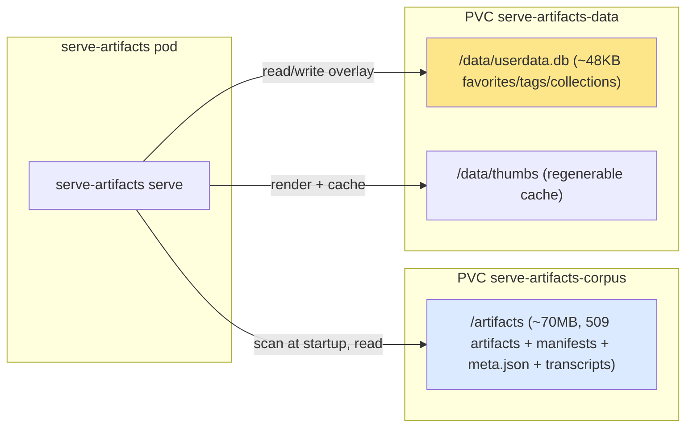
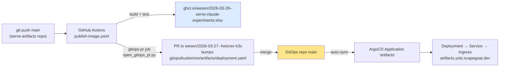
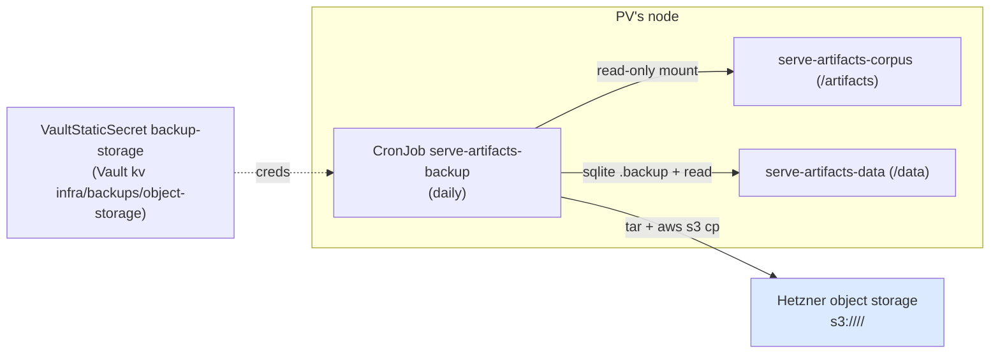

# Deploying serve-artifacts to k3s: Analysis, Design and Implementation Guide

This guide is for an engineer who has never deployed to this cluster and needs to take `serve-artifacts` — the Claude.ai artifact gallery server — from "runs on my laptop" to "runs in production at `https://artifacts.yolo.scapegoat.dev`, keeps its data, and can be restored if the node dies." To do that safely you need three bodies of knowledge: what the app is and what data it depends on, how code becomes a running pod on this cluster, and what specifically has to change to make the app *stateful and backed up* rather than the *stateless* thing it is today. This guide builds those three in order.

The single most important idea, and the one most people get wrong first, is that **serve-artifacts has two completely different datasets with different sizes, lifecycles, and failure consequences.** Confusing them leads to backing up the wrong thing or seeding the wrong thing. We start there.

> [!summary]
> - The app depends on **two datasets**: the **corpus** (files under `/artifacts` — ~70 MB of artifacts + `meta.json` + `conversation.md` + `*.manifest.json`, read into an in-memory index at startup) and the **user state** (`/data/userdata.db`, a ~48 KB SQLite file of favorites/tags/collections). The corpus is what makes the gallery look full; the DB is a tiny per-user overlay. Thumbnails (`/data/thumbs`) are a regenerable cache, not data.
> - The **delivery pipeline already exists**: a push to `main` builds the image, pushes `ghcr.io/wesen/2026-03-29--serve-claude-experiments:sha-<short>`, and opens a GitOps PR that bumps the image in `wesen/2026-03-27--hetzner-k3s` at `gitops/kustomize/artifacts/deployment.yaml`. ArgoCD auto-syncs. You do **not** build the CI; you extend the manifests it targets.
> - Today the Deployment is **stateless**: no PVC (data resets every restart), a **256Mi memory limit under an image that runs headless Chrome** (thumbnails will OOM), and no write-API token. Those three are the gaps.
> - The change: add **two `local-path` RWO PVCs** (`serve-artifacts-corpus` → `/artifacts`, `serve-artifacts-data` → `/data`), set `strategy: Recreate`, raise memory to ~1Gi and give Chrome a `/dev/shm`, and inject `SERVE_ARTIFACTS_WRITE_TOKEN` from a `VaultStaticSecret`.
> - **Seed once**, then the PVC is authoritative: scale the app to 0, run a maintenance pod mounting both PVCs, `tar`-stream the slimmed corpus into `/artifacts` and copy `userdata.db` into `/data`, scale back to 1. `local-path` pins every pod using a PVC to the volume's node, which is what makes this (and the backup) work under RWO.
> - **Back up off-node**: `local-path` is node-local disk — if the node is lost, the PVC is gone. A daily `CronJob` (the cluster's established pattern) takes a consistent SQLite `.backup`, `tar`s it with the corpus, and `aws s3 cp`s it to Hetzner object storage, with credentials from a `VaultStaticSecret` at `infra/backups/object-storage`.

## Part I — The application and its two datasets

`serve-artifacts` is a single Go binary. Its server command is defined at `cmd/serve-artifacts/cmds/serve.go` and, in the container, runs as (see `Dockerfile` `CMD`):

```
serve-artifacts serve --dir /artifacts --port 8080 --thumbs /data/thumbs --db /data/userdata.db
```

At startup it scans `--dir` into an in-memory index (`pkg/server/index.go` `searchIndex.rebuild`, backed by `pkg/artifacts/scanner.go`), opens the SQLite user-data store (`pkg/userdata/store.go`), and serves HTTP on `:8080`. Every read answers from the in-memory index; the SQLite DB supplies the acting user's favorites/tags/collections overlay.

### 1.1 The corpus (`/artifacts`) — big, file-derived, the source of "what exists"

The corpus is a directory tree with one subdirectory per conversation. The scanner reads four kinds of files and ignores the rest:

| File | Count (current export) | Read by | Purpose |
|---|---|---|---|
| `*/artifacts/*.html`, `*.jsx` | 509 renderable | scanner (source + index) | the artifacts themselves |
| `*/<name>.manifest.json` | 509 | `pkg/artifacts/manifest.go` | title/description/tags/date you indexed |
| `*/meta.json` | 2,896 | `pkg/artifacts/export_meta.go` | provenance (model, dates, claude URL) |
| `*/conversation.md` | 2,896 | index (transcript view) | the transcript |
| `*/conversation.json` | 2,896 | **nobody at runtime** | raw export — **droppable** |

The full export on disk is ~196 MB, but the raw `conversation.json` files are ~126 MB and the server never reads them, so a **serving corpus is ~70 MB**. This is the dataset that makes the gallery look complete: the 509 artifacts and their manifests are what you see. It changes over time — new downloads, and now runtime `artifact push` calls (Part VII).

### 1.2 The user state (`/data/userdata.db`) — tiny, mutable, per-user

`userdata.db` is a single SQLite file (schema in `pkg/userdata/store.go`) with three tables of interest — `favorites`, `artifact_tags`, `collections`/`collection_items` — each keyed by `user_id` + the artifact's `Name`. It is small (tens of KB) and holds only the per-user overlay. Losing it loses favorites/collections, not artifacts.

### 1.3 Thumbnails (`/data/thumbs`) — a cache, not data

Thumbnails are rendered by headless Chrome and cached by content hash under `/data/thumbs` (`pkg/server/thumbnail.go`). They regenerate on demand, so they are worth *persisting* (to avoid a re-render storm after a restart) but **not worth backing up**.



## Part II — How code becomes a running pod (the pipeline that already exists)

You are extending a working delivery pipeline, not building one. Understand its stages so you know which repo owns which change.



- **Build + publish** (`.github/workflows/publish-image.yaml` in this repo): on push to `main`, run `go test`, build the `Dockerfile`, push to GHCR with an immutable `sha-<short>` tag (plus `main`/`latest`).
- **GitOps PR** (same workflow, `gitops-pr` job → `scripts/open_gitops_pr.py` reading `deploy/gitops-targets.json`): clone the GitOps repo `wesen/2026-03-27--hetzner-k3s`, rewrite the `image:` of the container named `serve-artifacts` in `gitops/kustomize/artifacts/deployment.yaml`, and open a PR. Requires the `GITOPS_PR_TOKEN` repo secret (a PAT/Actions token that can push + open PRs on the GitOps repo).
- **ArgoCD** (GitOps repo `gitops/applications/artifacts.yaml`): the `artifacts` Application watches `gitops/kustomize/artifacts` with `automated: {prune, selfHeal}`, so a merged PR reconciles automatically. The Application had to be `kubectl apply`-ed once (it already was — the app exists today).

The key ownership rule: **image bumps are automatic; structural changes (PVCs, secrets, backups) are a manual PR to the GitOps repo.** This guide's implementation is exactly that manual PR.

## Part III — Cluster conventions (what the GitOps repo already standardizes)

You do not invent infrastructure; you follow the cluster's conventions. The ones that matter here, each with a file to copy from:

- **Ingress**: Traefik (`ingressClassName: traefik`), one host `\<app>.yolo.scapegoat.dev`. Already set for us in `gitops/kustomize/artifacts/ingress.yaml` (`artifacts.yolo.scapegoat.dev`).
- **TLS**: cert-manager with the `letsencrypt-prod` ClusterIssuer (annotation on the Ingress); the cert lands in the `secretName` from the `tls` block. Already set.
- **Storage**: exactly one StorageClass, `local-path` (k3s local-path-provisioner), always `ReadWriteOnce`. It is **node-local disk** — the PV gets nodeAffinity to the node it was provisioned on, and every pod using it is scheduled there. Template: `gitops/kustomize/docs-yolo/pvc.yaml`.
- **Secrets**: HashiCorp Vault + the Vault Secrets Operator (VSO). A per-app chain — `ServiceAccount` → `VaultConnection` → `VaultAuth` (kubernetes auth, `role: \<app>`) → `VaultStaticSecret` (reads a Vault KV path, renders a k8s `Secret`). No sealed-secrets/SOPS. Template: `gitops/kustomize/docs-yolo/{serviceaccount,vault-connection,vault-auth,vault-static-secret}.yaml`.
- **Backups**: an established pattern — a `VaultStaticSecret` named `backup-storage` reading Vault KV `infra/backups/object-storage` (keys `storage-endpoint`, `storage-region`, `bucket-name`, `access-key`, `secret-key`, `\<app>-prefix`) plus a `CronJob` that `aws s3 cp`s an archive to the bucket. Template: `gitops/kustomize/redis/{backup-cronjob,backup-storage-vault-static-secret}.yaml`.
- **Namespaces & projects**: one namespace per app (`artifacts`), and the namespace must be allow-listed in the app's ArgoCD `AppProject` (`gitops/projects/demo-apps.yaml` already lists `artifacts`).
- **kubeconfig**: the cluster API is reachable only over Tailscale — use `$PWD/.cache/kubeconfig-tailnet.yaml`, not a public endpoint.

## Part IV — The change: stateless → stateful

The current `gitops/kustomize/artifacts/deployment.yaml` is stateless and has three concrete problems for a real deployment:

1. **No persistence.** No PVC, no volume — `/artifacts` is whatever is baked into the image (the sample `imports/`), and `/data` is ephemeral, so favorites/tags/collections and the thumb cache vanish on every restart.
2. **Chrome will OOM.** The image installs `chromium` and the default `CMD` renders thumbnails, but the container has `resources.limits.memory: 256Mi`. A headless Chrome render needs far more; the pod will be OOM-killed on the first thumbnail. Either raise memory or run with `--no-thumbnails`. We raise memory, because thumbnails are a core feature.
3. **Unauthenticated writes.** The write API (`POST /api/artifacts`, `PUT/PATCH /api/manifest/...`) is gated by `SERVE_ARTIFACTS_WRITE_TOKEN` (`pkg/server/artifactapi.go` `authorize`), which is unset, so writes are open. Behind a public ingress that is unacceptable.

The fixed Deployment (full manifest in the implementation; the load-bearing additions shown here):

```yaml
spec:
  strategy: { type: Recreate }              # RWO PVC: never two pods on the volume at once
  template:
    spec:
      serviceAccountName: serve-artifacts   # carries Vault identity (and any imagePullSecret)
      containers:
        - name: serve-artifacts
          image: ghcr.io/wesen/2026-03-29--serve-claude-experiments:sha-<bumped by CI>
          env:
            - name: SERVE_ARTIFACTS_WRITE_TOKEN
              valueFrom: { secretKeyRef: { name: serve-artifacts-runtime, key: write-token } }
            # SERVE_ARTIFACTS_CHROME_NO_SANDBOX=1 is already baked into the image.
          volumeMounts:
            - { name: corpus, mountPath: /artifacts }
            - { name: data,   mountPath: /data }
            - { name: dshm,   mountPath: /dev/shm }   # headless Chrome shared memory
          resources:
            requests: { cpu: 100m, memory: 256Mi }
            limits:   { memory: 1Gi }                 # room for a Chrome render
      volumes:
        - { name: corpus, persistentVolumeClaim: { claimName: serve-artifacts-corpus } }
        - { name: data,   persistentVolumeClaim: { claimName: serve-artifacts-data } }
        - { name: dshm,   emptyDir: { medium: Memory, sizeLimit: 256Mi } }
```

Why each piece:

- **`strategy: Recreate`** — with a `ReadWriteOnce` PVC, a rolling update would try to start a new pod holding the volume while the old one still has it; `Recreate` tears the old pod down first. (The alternative — `RollingUpdate` with `maxSurge: 0` — also works; `Recreate` is simpler and fine for a single-replica app.)
- **Two PVCs** — the corpus and the user state have different lifecycles (the corpus is large and grows via pushes; the DB is tiny and mutated constantly). Separating them keeps the backup and the seed independent, and lets you resize or restore one without the other.
- **`/dev/shm` emptyDir (Memory)** — Chrome uses `/dev/shm`; the container default is tiny and causes render crashes. A `medium: Memory` emptyDir gives it real shared memory. (The renderer also passes `--disable-dev-shm-usage`, but giving it a proper `/dev/shm` is the belt to that suspenders.)
- **Memory to 1Gi** — one headless-Chrome tab plus the Go server. If you would rather not pay for it, the escape hatch is adding `--no-thumbnails` to the container `args` and dropping the memory back; the gallery then serves placeholder thumbnails.
- **Write token from Vault** — the app compares the `Authorization: Bearer` token against `SERVE_ARTIFACTS_WRITE_TOKEN` (constant-time). Injecting it from a `Secret` keeps it out of git and lets you rotate it in Vault.

The two PVCs:

```yaml
apiVersion: v1
kind: PersistentVolumeClaim
metadata: { name: serve-artifacts-corpus }
spec:
  accessModes: [ReadWriteOnce]
  storageClassName: local-path
  resources: { requests: { storage: 2Gi } }   # ~70MB today, room to grow via pushes
---
apiVersion: v1
kind: PersistentVolumeClaim
metadata: { name: serve-artifacts-data }
spec:
  accessModes: [ReadWriteOnce]
  storageClassName: local-path
  resources: { requests: { storage: 1Gi } }    # userdata.db + thumb cache
```

## Part V — Seeding the data once

Neither PVC has anything in it when first created. The corpus (~70 MB, ~10k files) and the DB (~48 KB) are seeded **once**; after that the PVC is authoritative and normal operation (and `artifact push`) evolves it.

The important constraint that makes seeding (and backup) tractable: **`local-path` pins every pod that mounts a PVC to that PVC's node.** So a maintenance pod that mounts the same PVCs is automatically co-located with (or replaces) the app on the right node, and RWO "one node" is satisfied. The seed procedure:

```
# pseudocode / runbook — one time
scale deploy/serve-artifacts to 0                 # release the RWO volumes, close the DB
run a maintenance pod mounting BOTH PVCs (busybox), sleeping
# stream a slimmed corpus (drop the 126MB of unused conversation.json) straight in:
tar -C ~/Downloads/claude-downloads --exclude=conversation.json -cf - . \
  | kubectl exec -i <maint-pod> -- tar -C /artifacts -xf -
# consistent SQLite snapshot into /data:
sqlite3 <local userdata.db> ".backup /tmp/seed.db" && kubectl cp /tmp/seed.db <maint-pod>:/data/userdata.db
delete the maintenance pod
scale deploy/serve-artifacts to 1
```

Two details that matter:

- **`tar`-stream, not `kubectl cp` per file.** Copying 10k files individually is slow and flaky; a single `tar | exec tar -x` stream moves the whole tree in one shot.
- **SQLite `.backup`, not `cp`.** A live SQLite file has `-wal`/`-shm` sidecars; a raw copy can miss committed rows. `sqlite3 ".backup"` (or stopping the source server first) yields a consistent single file. This applies to seeding *and* to the backup CronJob.

The full script lives in this ticket at `scripts/01-seed-pvcs.sh`.

## Part VI — Persistence and off-node backup

`local-path` gives **persistence across pod restarts** (the PVC survives), but **not durability against node loss**: the data is a directory on one node's disk. If that node is rebuilt, both PVCs are gone. "Backed up" therefore means **off-node**, and the cluster's convention is a `CronJob` that ships an archive to Hetzner object storage.



Design decisions:

- **Why a CronJob can mount an RWO volume the app is using.** `local-path`'s PV has nodeAffinity to the app's node, so the CronJob pod is scheduled onto that same node, where a second (read-only) mount of a `ReadWriteOnce` volume is allowed (RWO is *per node*, not per pod). No Multi-Attach error. Mount read-only so the backup can never corrupt live data.
- **What to back up.** `userdata.db` (precious, tiny — snapshot with `sqlite3 ".backup"`) and `/artifacts` (the corpus, including anything pushed at runtime that exists nowhere else). **Skip `/data/thumbs`** — it regenerates. Backing up thumbs would multiply the archive size for no recovery value.
- **Where and how.** `aws --endpoint-url "$S3_ENDPOINT" s3 cp archive s3://$S3_BUCKET/$S3_PREFIX...`, credentials from the `backup-storage` `VaultStaticSecret` (same keys the redis/postgres backups use). The per-app object prefix (`serve-artifacts-prefix`) is a key in the shared `infra/backups/object-storage` Vault secret — add it there.
- **Retention.** Match the house pattern (the redis CronJob relies on bucket lifecycle rules for expiry); document that a lifecycle policy on the bucket prefix is what prunes old archives. If you want in-job retention, add a `aws s3 ls | sort | head -n -N | xargs rm` step.
- **Restore** is the inverse of seed: `aws s3 cp` the latest archive down, `tar -x` into a maintenance pod's `/artifacts`, drop `userdata.db` into `/data`, scale the app back up. The restore runbook is in `scripts/`.

The CronJob (abridged; full manifest in the implementation) mirrors `gitops/kustomize/redis/backup-cronjob.yaml`:

```yaml
schedule: "20 4 * * *"
concurrencyPolicy: Forbid
jobTemplate: { spec: { template: { spec: {
  serviceAccountName: serve-artifacts
  restartPolicy: OnFailure
  containers: [{ name: backup, image: alpine:3.20, command: ["sh","-ec", "<<script>>"],
    env: [ /* S3_* from backup-storage secret */ ],
    volumeMounts: [ {name: corpus, mountPath: /artifacts, readOnly: true},
                    {name: data,   mountPath: /data,      readOnly: true} ] }]
  volumes: [ {name: corpus, persistentVolumeClaim: {claimName: serve-artifacts-corpus}},
             {name: data,   persistentVolumeClaim: {claimName: serve-artifacts-data}} ] }}}}
# script:
#   apk add --no-cache aws-cli sqlite tar gzip
#   ts=$(date -u +%Y%m%dT%H%M%SZ)
#   sqlite3 /data/userdata.db ".backup /tmp/userdata.db"     # consistent snapshot (ro mount: copy to /tmp first if needed)
#   tar -C / -czf /tmp/sa-$ts.tar.gz artifacts tmp/userdata.db
#   aws --endpoint-url "$S3_ENDPOINT" s3 cp /tmp/sa-$ts.tar.gz s3://$S3_BUCKET/${S3_PREFIX}sa-$ts.tar.gz
```

> Note on the read-only DB mount: `sqlite3 ".backup"` needs to open the source; if the `/data` mount is read-only it still opens read-only fine, but the backup file is written to `/tmp` (emptyDir), never back to the PVC. Keep the PVC mounts read-only.

## Part VII — Auth in production

The write API's `authorize()` (`pkg/server/artifactapi.go`) enforces a shared bearer token **only when one is configured**. In production it must be configured. The token is stored in Vault (`apps/serve-artifacts/prod/runtime`, key `write-token`), rendered into the `serve-artifacts-runtime` k8s Secret by a `VaultStaticSecret`, and injected as `SERVE_ARTIFACTS_WRITE_TOKEN` (Part IV). Clients (the `artifact` CLI, or CI) send it as `--token` / `SERVE_ARTIFACTS_TOKEN`. Reads stay open; only push/modify require it. Rotating the token is a Vault write plus a pod restart — no manifest change.

## Part VIII — Runbook

First rollout (one-time bootstrap), assuming the manifests from Part IV–VI are merged to the GitOps repo:

```bash
export KUBECONFIG=$PWD/.cache/kubeconfig-tailnet.yaml     # Tailscale kubeconfig

# 0. Seed Vault (out of band): write-token + object-storage prefix
#    scripts/00-bootstrap-vault.sh  (vault kv put apps/serve-artifacts/prod/runtime write-token=...;
#                                     vault kv patch infra/backups/object-storage serve-artifacts-prefix=serve-artifacts/)

# 1. ArgoCD picks up the merged manifests automatically (Application already applied). Force a refresh if impatient:
kubectl -n argocd annotate application artifacts argocd.argoproj.io/refresh=hard --overwrite

# 2. Seed the PVCs once (Part V)
scripts/01-seed-pvcs.sh

# 3. Verify
kubectl -n argocd get application artifacts          # Synced / Healthy
kubectl -n artifacts get pods                          # Running, not OOMKilled/CrashLoop
curl -fsS https://artifacts.yolo.scapegoat.dev/ | head # 200, gallery HTML
kubectl -n artifacts create job --from=cronjob/serve-artifacts-backup manual-backup-check  # backup runs green

# 4. Confirm the backup landed
#    aws --endpoint-url <ep> s3 ls s3://<bucket>/serve-artifacts/ | tail
```

## Part IX — Failure modes

- **Pod `OOMKilled` on first gallery view.** Memory limit too low for Chrome. Raise `limits.memory` (Part IV) or add `--no-thumbnails`.
- **`Multi-Attach error for volume ...`.** Two pods on different nodes tried to mount the RWO PVC. With `local-path` this only happens if you removed the PV's nodeAffinity or forced a pod elsewhere; keep `strategy: Recreate` and don't pin the CronJob to a different node.
- **Data resets on restart.** A PVC is missing or not mounted, so the app is writing to the ephemeral container FS. Check `volumeMounts`/`volumes` and that the PVCs are `Bound`.
- **Writes rejected with 403 in prod / accepted in dev.** `SERVE_ARTIFACTS_WRITE_TOKEN` set (prod) vs unset (dev). Send `--token`; check the `serve-artifacts-runtime` Secret exists (VSO synced).
- **Backup job fails with `NoSuchBucket`/`AccessDenied`.** The `backup-storage` Secret is missing the `serve-artifacts-prefix` key or the object-storage creds are wrong; check Vault `infra/backups/object-storage`.
- **Inconsistent DB in backup/seed.** A raw `cp` of a live SQLite file. Always use `sqlite3 ".backup"`.
- **GitOps PR job fails: "manifest does not exist".** Only relevant if the kustomize path/target moves; the current target (`gitops/kustomize/artifacts/deployment.yaml`, container `serve-artifacts`) already exists.

## Part X — Recommended build order

1. **Manifests** (GitOps repo branch): add `serviceaccount.yaml`, `vault-connection.yaml`, `vault-auth.yaml`, `runtime-vault-static-secret.yaml`, `backup-storage-vault-static-secret.yaml`, `pvc-corpus.yaml`, `pvc-data.yaml`, `backup-cronjob.yaml`; edit `deployment.yaml` (volumes, env, strategy, resources, /dev/shm) and `kustomization.yaml`; flip the Application labels (`has-persistent-storage: "true"`, `has-database: "true"`). Validate locally with `kubectl kustomize gitops/kustomize/artifacts`.
2. **Scripts** (this ticket): `00-bootstrap-vault.sh`, `01-seed-pvcs.sh`, `02-restore.sh`.
3. **Vault seeding**: write the token and the object-storage prefix.
4. **Merge → ArgoCD sync → seed → verify → backup check** (Part VIII).

## Important project docs

- `SERVE-20260714-ARTIFACTAPI` (this repo) — the write API + `authorize()` seam that `SERVE_ARTIFACTS_WRITE_TOKEN` now enforces.
- GitOps repo `README.md` §"Deploy a New App", `docs/app-deployment-pipeline.md`, `docs/app-runtime-secrets-and-identity-provisioning-playbook.md`.
- Templates to copy: `gitops/kustomize/docs-yolo/` (PVC + Vault chain), `gitops/kustomize/redis/` (backup CronJob + storage secret).

## Open questions

- Corpus growth policy: is `/artifacts` authoritative (grown only via `artifact push`) or periodically re-synced from `~/Downloads/claude-downloads`? If the latter, add a sync Job rather than treating the PVC as source of truth.
- Backup retention: bucket lifecycle rule vs in-job prune — pick one and document the window.
- Do we want thumbnails at all in prod (1Gi memory) or `--no-thumbnails` (cheaper, placeholder images)?

## Near-term next steps

Implement Part X in order: GitOps manifests on a branch, the three scripts in this ticket, Vault seeding, then the guarded rollout. Keep the diary (`reference/01-diary.md`) current.

## Project working rule

Two datasets, two lifecycles: the **corpus** (`/artifacts`, large, grows via pushes) and the **user state** (`/data/userdata.db`, tiny, mutated constantly) each get their own PVC, are seeded once, and are backed up off-node — because `local-path` is node-local and a lost node is a lost PVC. Thumbnails are a cache: persist, don't back up. Secrets come from Vault, never git. Seed and back up SQLite with `.backup`, never a raw copy.
